# Core Message Engine - Deep Audit Documentation

> **Purpose**: This document explains exactly how SupportBase processes each message and decides whether AI responds or a human agent takes over. Written for any engineer to understand.

> **Complexity Note**: ~80% of the application's business logic lives in `processChat()`. This is the brain of the entire system.

---

## MASTER VISUAL FLOW (All 24 Cases)

```
┌─────────────────────────────────────────────────────────────────────────────────────┐
│                              USER SENDS MESSAGE                                      │
│                                     │                                                │
│                                     ▼                                                │
│                        ┌───────────────────────┐                                     │
│                        │  1. VALIDATE INPUT    │                                     │
│                        │  - Sanitize message   │                                     │
│                        │  - Check length       │                                     │
│                        └───────────────────────┘                                     │
│                                     │                                                │
│                        ┌────────────┴────────────┐                                   │
│                        │                         │                                   │
│                        ▼                         ▼                                   │
│              ┌─────────────────┐      ┌─────────────────┐                           │
│              │  CASE 1: Empty  │      │  Valid Message  │                           │
│              │  ❌ THROW ERROR │      │  Continue ───────┼──────────────────┐       │
│              └─────────────────┘      └─────────────────┘                   │       │
│                                                                              │       │
│                                                                              ▼       │
│                                                         ┌───────────────────────────┐│
│                                                         │  2. CHECK HANDOFF STATE   ││
│                                                         │  Is conversation already  ││
│                                                         │  with human agent?        ││
│                                                         └───────────────────────────┘│
│                                                                    │                 │
│                               ┌────────────────────────────────────┼─────────────┐   │
│                               │                                    │             │   │
│                               ▼                                    ▼             ▼   │
│                    ┌─────────────────────┐              ┌─────────────────┐  ┌──────┐│
│                    │ CASE 3: agent_active│              │ CASE 4: waiting │  │  NO  ││
│                    │ ✅ Store msg only   │              │ ✅ Store msg    │  │      ││
│                    │ Return empty        │              │ Return empty    │  │      ││
│                    │ reason:"agent_      │              │ reason:"in_     │  │      ││
│                    │        handling"    │              │        queue"   │  │      ││
│                    └─────────────────────┘              └─────────────────┘  └──┬───┘│
│                                                                                 │    │
│                                                                                 ▼    │
│                                                         ┌───────────────────────────┐│
│                                                         │  3. GET PROJECT CONFIG    ││
│                                                         │  Load from DB (cached)    ││
│                                                         └───────────────────────────┘│
│                                                                    │                 │
│                                              ┌─────────────────────┴───────────┐     │
│                                              │                                 │     │
│                                              ▼                                 ▼     │
│                                   ┌─────────────────────┐           ┌──────────────┐ │
│                                   │  CASE 2: Not Found  │           │   Found      │ │
│                                   │  ❌ THROW ERROR     │           │   Continue   │ │
│                                   └─────────────────────┘           └──────┬───────┘ │
│                                                                            │         │
└────────────────────────────────────────────────────────────────────────────┼─────────┘
                                                                             │
                                                                             ▼
┌─────────────────────────────────────────────────────────────────────────────────────┐
│                              GATE 1: KEYWORD TRIGGER                                 │
│                                                                                      │
│                           ┌───────────────────────────┐                              │
│                           │  4. CHECK KEYWORD TRIGGER │                              │
│                           │  Does message contain     │                              │
│                           │  "speak to human", etc?   │                              │
│                           └───────────────────────────┘                              │
│                                        │                                             │
│                          ┌─────────────┴─────────────┐                               │
│                          │                           │                               │
│                     KEYWORD FOUND               NO KEYWORD                           │
│                          │                           │                               │
│                          ▼                           │                               │
│              ┌─────────────────────┐                 │                               │
│              │ Check Business Hours│                 │                               │
│              └─────────────────────┘                 │                               │
│                          │                           │                               │
│            ┌─────────────┴─────────────┐             │                               │
│            │                           │             │                               │
│         OUTSIDE                     WITHIN           │                               │
│            │                           │             │                               │
│            ▼                           ▼             │                               │
│  ┌─────────────────────┐   ┌─────────────────────┐   │                               │
│  │ CASE 5: Offline     │   │ Check Agent         │   │                               │
│  │ ✅ "Team is offline"│   │ Availability        │   │                               │
│  │ No queue created    │   └─────────────────────┘   │                               │
│  └─────────────────────┘              │              │                               │
│                          ┌────────────┴────────────┐ │                               │
│                          │                         │ │                               │
│                     NO AGENTS                 AGENTS EXIST                           │
│                          │                         │ │                               │
│                          ▼                         ▼ │                               │
│              ┌─────────────────────┐   ┌─────────────────────┐                       │
│              │ CASE 6: Unavailable │   │ Check Previous Agent│                       │
│              │ ✅ "Team unavailable"│   └─────────────────────┘                       │
│              │ No queue created    │              │                                  │
│              └─────────────────────┘    ┌─────────┴─────────┐                        │
│                                         │                   │                        │
│                                   PREV AGENT           NO PREV AGENT                 │
│                                   AVAILABLE            OR UNAVAILABLE                │
│                                         │                   │                        │
│                                         ▼                   ▼                        │
│                            ┌─────────────────────┐  ┌─────────────────────┐          │
│                            │ CASE 7: Reconnect   │  │ CASE 8: Queue       │          │
│                            │ ✅ Direct to prev   │  │ ✅ "You're #X in    │          │
│                            │ agent               │  │    queue"           │          │
│                            │ status→agent_active │  │ status→waiting      │          │
│                            └─────────────────────┘  └─────────────────────┘          │
│                                                                                      │
│                                         ├─────────────────────────────────┐          │
│                                         │ (All CASE 5-8 EXIT here)        │          │
└─────────────────────────────────────────┴─────────────────────────────────┴──────────┘
                                                                             │
                                                              (NO KEYWORD)   │
                                                                             ▼
┌─────────────────────────────────────────────────────────────────────────────────────┐
│                                 RAG SEARCH                                           │
│                                                                                      │
│                           ┌───────────────────────────┐                              │
│                           │  5. HYBRID RAG SEARCH     │                              │
│                           │  Vector + Full-Text       │                              │
│                           │  with RRF Fusion          │                              │
│                           └───────────────────────────┘                              │
│                                        │                                             │
│                                        ▼                                             │
│                           ┌───────────────────────────┐                              │
│                           │  Retrieved Chunks[]       │                              │
│                           │  Each with combinedScore  │                              │
│                           └───────────────────────────┘                              │
│                                        │                                             │
└────────────────────────────────────────┼─────────────────────────────────────────────┘
                                         │
                                         ▼
┌─────────────────────────────────────────────────────────────────────────────────────┐
│                         GATE 2: LOW CONFIDENCE CHECK                                 │
│                                                                                      │
│                           ┌───────────────────────────┐                              │
│                           │  6. CHECK CONFIDENCE      │                              │
│                           │  Is maxScore < 0.3?       │                              │
│                           └───────────────────────────┘                              │
│                                        │                                             │
│                          ┌─────────────┴─────────────┐                               │
│                          │                           │                               │
│                    LOW CONFIDENCE             GOOD CONFIDENCE                        │
│                    (maxScore < 0.3)           (maxScore >= 0.3)                      │
│                          │                           │                               │
│                          ▼                           │                               │
│              ┌─────────────────────┐                 │                               │
│              │ Check Business Hours│                 │                               │
│              └─────────────────────┘                 │                               │
│                          │                           │                               │
│            ┌─────────────┴─────────────┐             │                               │
│            │                           │             │                               │
│         OUTSIDE                     WITHIN           │                               │
│            │                           │             │                               │
│            ▼                           ▼             │                               │
│  ┌─────────────────────┐   ┌─────────────────────┐   │                               │
│  │ CASE 9: Offline     │   │ Check Agent         │   │                               │
│  │ ✅ "Not sure...team │   │ Availability        │   │                               │
│  │    is offline"      │   └─────────────────────┘   │                               │
│  └─────────────────────┘              │              │                               │
│                          ┌────────────┴────────────┐ │                               │
│                          │                         │ │                               │
│                     NO AGENTS                 AGENTS EXIST                           │
│                          │                         │ │                               │
│                          ▼                         ▼ │                               │
│              ┌─────────────────────┐   ┌─────────────────────┐                       │
│              │ CASE 10: Unavailable│   │ Check Previous Agent│                       │
│              │ ✅ "Not sure...team │   └─────────────────────┘                       │
│              │    unavailable"     │              │                                  │
│              └─────────────────────┘    ┌─────────┴─────────┐                        │
│                                         │                   │                        │
│                                   PREV AGENT           NO PREV AGENT                 │
│                                   AVAILABLE            OR UNAVAILABLE                │
│                                         │                   │                        │
│                                         ▼                   ▼                        │
│                            ┌─────────────────────┐  ┌─────────────────────┐          │
│                            │ CASE 11: Reconnect  │  │ CASE 12: Queue      │          │
│                            │ ✅ "Not sure...let  │  │ ✅ "Not sure...     │          │
│                            │ me reconnect you"   │  │ You're #X in queue" │          │
│                            └─────────────────────┘  └─────────────────────┘          │
│                                                                                      │
│                                         ├─────────────────────────────────┐          │
│                                         │ (All CASE 9-12 EXIT here)       │          │
└─────────────────────────────────────────┴─────────────────────────────────┴──────────┘
                                                                             │
                                                       (GOOD CONFIDENCE)     │
                                                                             ▼
┌─────────────────────────────────────────────────────────────────────────────────────┐
│                              LLM PROCESSING                                          │
│                                                                                      │
│                           ┌───────────────────────────┐                              │
│                           │  7. BUILD SYSTEM PROMPT   │                              │
│                           │  + RAG context            │                              │
│                           │  + Tool descriptions      │                              │
│                           │  + Chat history           │                              │
│                           └───────────────────────────┘                              │
│                                        │                                             │
│                                        ▼                                             │
│                           ┌───────────────────────────┐                              │
│                           │  8. CALL LLM (GPT-4o-mini)│◄─────────────────┐           │
│                           │  max_tokens: 800          │                  │           │
│                           │  temperature: 0.7         │                  │           │
│                           │  timeout: 30s             │                  │           │
│                           └───────────────────────────┘                  │           │
│                                        │                                 │           │
│                    ┌───────────────────┼───────────────────┐             │           │
│                    │                   │                   │             │           │
│                    ▼                   ▼                   ▼             │           │
│         ┌─────────────────┐ ┌─────────────────┐ ┌─────────────────┐      │           │
│         │ CASE 18: Timeout│ │ Has tool_calls? │ │ CASE 17: Empty  │      │           │
│         │ ❌ >30 seconds  │ │                 │ │ ❌ Empty response│      │           │
│         │ Return fallback │ │                 │ │ Return fallback │      │           │
│         └─────────────────┘ └────────┬────────┘ └─────────────────┘      │           │
│                                      │                                   │           │
│                          ┌───────────┴───────────┐                       │           │
│                          │                       │                       │           │
│                    HAS TOOLS                 NO TOOLS                    │           │
│                          │                       │                       │           │
│                          ▼                       │                       │           │
│              ┌─────────────────────┐             │                       │           │
│              │  9. EXECUTE TOOLS   │             │                       │           │
│              │  (API calls)        │             │                       │           │
│              └─────────────────────┘             │                       │           │
│                          │                       │                       │           │
│            ┌─────────────┴─────────────┐         │                       │           │
│            │                           │         │                       │           │
│         SUCCESS                     FAILURE      │                       │           │
│            │                           │         │                       │           │
│            ▼                           ▼         │                       │           │
│  ┌─────────────────────┐   ┌─────────────────────┐                       │           │
│  │ CASE 14: Tool OK    │   │ CASE 15: Tool Fail │                       │           │
│  │ Add result to msgs  │   │ Add error to msgs  │                       │           │
│  └─────────────────────┘   └─────────────────────┘                       │           │
│            │                           │         │                       │           │
│            └───────────┬───────────────┘         │                       │           │
│                        │                         │                       │           │
│                        ▼                         │                       │           │
│              ┌─────────────────────┐             │                       │           │
│              │ iterations < 3?     │             │                       │           │
│              └─────────────────────┘             │                       │           │
│                        │                         │                       │           │
│            ┌───────────┴───────────┐             │                       │           │
│            │                       │             │                       │           │
│           YES                     NO             │                       │           │
│            │                       │             │                       │           │
│            │                       ▼             │                       │           │
│            │           ┌─────────────────────┐   │                       │           │
│            │           │ CASE 16: Max loops  │   │                       │           │
│            │           │ Return fallback     │   │                       │           │
│            │           └─────────────────────┘   │                       │           │
│            │                                     │                       │           │
│            └─────────────────────────────────────┼───────────────────────┘           │
│                        │                         │                                   │
│                        │ (Loop back to LLM)      │                                   │
│                        └─────────────────────────┘                                   │
│                                                                                      │
│                                        │                                             │
│                                        ▼                                             │
│                           ┌───────────────────────────┐                              │
│                           │  CASE 13: Normal Response │                              │
│                           │  ✅ AI generates answer   │                              │
│                           └───────────────────────────┘                              │
│                                        │                                             │
└────────────────────────────────────────┼─────────────────────────────────────────────┘
                                         │
                                         ▼
┌─────────────────────────────────────────────────────────────────────────────────────┐
│                            GATE 3: LEAD CAPTURE                                      │
│                                                                                      │
│                           ┌───────────────────────────┐                              │
│                           │  10. LEAD CAPTURE CHECK   │                              │
│                           │  Is lead_capture_enabled? │                              │
│                           └───────────────────────────┘                              │
│                                        │                                             │
│                          ┌─────────────┴─────────────┐                               │
│                          │                           │                               │
│                       ENABLED                    DISABLED                            │
│                          │                           │                               │
│                          ▼                           │                               │
│              ┌─────────────────────┐                 │                               │
│              │ Was awaiting email? │                 │                               │
│              │ (from prev turn)    │                 │                               │
│              └─────────────────────┘                 │                               │
│                          │                           │                               │
│            ┌─────────────┴─────────────┐             │                               │
│            │                           │             │                               │
│           YES                          NO            │                               │
│            │                           │             │                               │
│            ▼                           ▼             │                               │
│  ┌───────────────────┐     ┌───────────────────┐     │                               │
│  │ Check user input  │     │ Did bot answer?   │     │                               │
│  └───────────────────┘     └───────────────────┘     │                               │
│            │                           │             │                               │
│    ┌───────┼───────┐         ┌─────────┴─────────┐   │                               │
│    │       │       │         │                   │   │                               │
│  EMAIL  DECLINE  OTHER      YES                 NO   │                               │
│    │       │       │         │                   │   │                               │
│    ▼       ▼       ▼         │                   ▼   │                               │
│ ┌──────┐┌──────┐┌──────┐     │      ┌───────────────────┐                            │
│ │CASE  ││CASE  ││CASE  │     │      │ Was email already │                            │
│ │20    ││21    ││22    │     │      │ asked?            │                            │
│ │Email ││User  ││New Q │     │      └───────────────────┘                            │
│ │saved ││said  ││Store │     │                   │                                   │
│ │✅    ││no ✅ ││prev  │     │         ┌─────────┴─────────┐                         │
│ └──────┘└──────┘│lead  │     │         │                   │                         │
│                 │✅    │     │        YES                  NO                        │
│                 └──────┘     │         │                   │                         │
│                              │         │                   ▼                         │
│                              │         │      ┌─────────────────────┐                │
│                              │         │      │ CASE 19: Ask email  │                │
│                              │         │      │ ✅ Append: "Would   │                │
│                              │         │      │ you like to leave   │                │
│                              │         │      │ your email?"        │                │
│                              │         │      └─────────────────────┘                │
│                              │         │                   │                         │
│                              │         │                   │                         │
│                              ▼         ▼                   ▼                         │
│                           ┌───────────────────────────────────┐                      │
│                           │         CONTINUE TO OUTPUT        │                      │
│                           └───────────────────────────────────┘                      │
│                                                                                      │
│    ┌──────────────────────────────────────────────────────────────────┐              │
│    │ CASE 23: Session Timeout (>30 min since last msg)               │              │
│    │ → Reset all lead capture state, treat as fresh conversation     │              │
│    └──────────────────────────────────────────────────────────────────┘              │
│                                                                                      │
└──────────────────────────────────────────────────────────────────────────────────────┘
                                         │
                                         ▼
┌─────────────────────────────────────────────────────────────────────────────────────┐
│                              FINAL OUTPUT                                            │
│                                                                                      │
│                           ┌───────────────────────────┐                              │
│                           │  11. LOG CONVERSATION     │                              │
│                           │  - chat_sessions (legacy) │                              │
│                           │  - conversations/messages │                              │
│                           └───────────────────────────┘                              │
│                                        │                                             │
│                                        ▼                                             │
│                           ┌───────────────────────────┐                              │
│                           │  12. RETURN RESPONSE      │                              │
│                           │  {                        │                              │
│                           │    response: string,      │                              │
│                           │    sessionId: string,     │                              │
│                           │    sources: [],           │                              │
│                           │    toolCalls: [],         │                              │
│                           │    processingTime: ms,    │                              │
│                           │    handoff?: {},          │                              │
│                           │    leadCapture?: {}       │                              │
│                           │  }                        │                              │
│                           └───────────────────────────┘                              │
│                                                                                      │
│    ┌──────────────────────────────────────────────────────────────────┐              │
│    │ CASE 24: Any Unhandled Error                                    │              │
│    │ → Catch all exceptions, return fallback response, don't crash   │              │
│    └──────────────────────────────────────────────────────────────────┘              │
│                                                                                      │
└──────────────────────────────────────────────────────────────────────────────────────┘
```

---

---

## MERMAID DIAGRAM (Full Business Logic)

```mermaid
flowchart TD
    subgraph INPUT["📥 MESSAGE INPUT"]
        A[/"User sends message"/]
    end

    A --> B

    subgraph VALIDATE["🔒 STEP 1: VALIDATE & SANITIZE"]
        B{"sanitizeUserInput()"}
        B -->|"Remove: 'ignore previous instructions'<br/>Remove: 'you are now', 'pretend to be'<br/>Trim whitespace<br/>Limit: 2000 chars"| C{Message empty<br/>after sanitize?}
        C -->|YES| D[/"❌ CASE 1: EMPTY_MESSAGE<br/>Throw ChatError"/]
        C -->|NO| E[Clean message ready]
    end

    E --> F

    subgraph HANDOFF_STATE["🤝 STEP 2: CHECK HANDOFF STATE"]
        F{sessionId<br/>provided?}
        F -->|NO| G[Skip handoff check]
        F -->|YES| H["Query: conversations table<br/>SELECT status WHERE id = sessionId"]
        H --> I{status = ?}
        I -->|"agent_active"| J[/"✅ CASE 3: AGENT HANDLING<br/>→ storeCustomerMessageOnly()<br/>→ Return empty response<br/>→ reason: 'agent_handling'"/]
        I -->|"waiting"| K[/"✅ CASE 4: IN QUEUE<br/>→ storeCustomerMessageOnly()<br/>→ Return empty response<br/>→ reason: 'in_queue'"/]
        I -->|"ai_active"| G
        I -->|"resolved/closed"| G
    end

    G --> L

    subgraph PROJECT["📋 STEP 3: GET PROJECT CONFIG"]
        L["getProjectConfig(projectId)<br/>Cache: 1 min TTL"]
        L --> M["Query: projects table<br/>SELECT id, name, settings"]
        M --> N{Project<br/>found?}
        N -->|NO| O[/"❌ CASE 2: PROJECT_NOT_FOUND<br/>Throw ChatError"/]
        N -->|YES| P["Extract:<br/>• name<br/>• system_prompt<br/>• support_email<br/>• support_url"]
    end

    P --> Q

    subgraph KEYWORD_GATE["🚨 GATE 1: KEYWORD TRIGGER CHECK"]
        Q["getHandoffSettings(projectId)<br/>Cache: 1 min TTL"]
        Q --> R["Query: handoff_settings table"]
        R --> S{handoff<br/>enabled?}
        S -->|NO| SKIP_KW[Skip keyword check]
        S -->|YES| T{keywords_enabled<br/>AND<br/>keywords.length > 0?}
        T -->|NO| SKIP_KW
        T -->|YES| U["checkKeywordTrigger()<br/>for each keyword:<br/>  if msg.toLowerCase().includes(kw)<br/>    return triggered"]
        U --> V{Keyword<br/>matched?}
        V -->|NO| SKIP_KW
        V -->|YES| W{{"🕐 isWithinBusinessHours()?<br/>─────────────────<br/>• Get current time in project timezone<br/>• Get day's hours config<br/>• Check: start ≤ now ≤ end"}}
        W -->|OUTSIDE HOURS| X[/"✅ CASE 5: KEYWORD + OFFLINE<br/>→ 'Team is currently offline...'<br/>→ No queue created"/]
        W -->|WITHIN HOURS| Y{{"👥 checkAgentAvailability()<br/>─────────────────<br/>• Query agent_availability<br/>• WHERE status = 'online'<br/>• Check: current_chat_count < max"}}
        Y -->|"NO AGENTS ONLINE"| Z[/"✅ CASE 6: KEYWORD + UNAVAILABLE<br/>→ 'Team is currently unavailable...'<br/>→ No queue created"/]
        Y -->|"AGENTS EXIST"| AA{{"🔄 Check Previous Agent<br/>─────────────────<br/>• Get conversation.assigned_agent_id<br/>• Check if that agent is online<br/>• Check if agent has capacity"}}
        AA -->|"PREV AGENT<br/>AVAILABLE"| AB[/"✅ CASE 7: KEYWORD + RECONNECT<br/>→ status = 'agent_active'<br/>→ 'Reconnected with previous agent'<br/>→ queuePosition = 1"/]
        AA -->|"PREV AGENT<br/>NOT AVAILABLE"| AC{{"📊 Calculate Queue Position<br/>─────────────────<br/>• COUNT(*) FROM conversations<br/>• WHERE status = 'waiting'<br/>• AND queue_entered_at < now"}}
        AC --> AD[/"✅ CASE 8: KEYWORD + QUEUED<br/>→ status = 'waiting'<br/>→ 'You are #X in queue'<br/>→ estimatedWait = X minutes"/]
    end

    SKIP_KW --> AE

    subgraph RAG["🔍 STEP 4: RAG HYBRID SEARCH"]
        AE["retrieve(projectId, message)"]
        AE --> AF["1. Generate Query Embedding<br/>model: text-embedding-3-small"]
        AF --> AG["2. Parallel Search"]
        AG --> AH["Vector Search<br/>pgvector similarity<br/>semantic matching"]
        AG --> AI["Full-Text Search<br/>PostgreSQL tsvector<br/>keyword matching"]
        AH --> AJ["3. RRF Fusion<br/>score = 1/(60 + rank)<br/>Merge & normalize to 0-1"]
        AI --> AJ
        AJ --> AK["4. Filter & Limit<br/>• threshold: 0.15<br/>• topK: 5 chunks<br/>• maxContent: 8000 chars"]
        AK --> AL[/"Retrieved Chunks[]<br/>Each with combinedScore"/]
    end

    AL --> AM

    subgraph CONFIDENCE_GATE["📉 GATE 2: LOW CONFIDENCE CHECK"]
        AM{low_confidence_enabled<br/>in settings?}
        AM -->|NO| SKIP_LC[Skip confidence check]
        AM -->|YES| AN{{"checkLowConfidence()<br/>─────────────────<br/>maxScore = Math.max(chunks.map(c => c.combinedScore))<br/>isLow = maxScore < threshold"}}
        AN --> AO{maxScore < 0.3<br/>OR<br/>chunks.length = 0?}
        AO -->|NO| SKIP_LC
        AO -->|YES| AP{{"🕐 isWithinBusinessHours()?"}}
        AP -->|OUTSIDE| AQ[/"✅ CASE 9: LOW CONF + OFFLINE<br/>→ 'Not sure...team is offline'"/]
        AP -->|WITHIN| AR{{"👥 checkAgentAvailability()"}}
        AR -->|NO AGENTS| AS[/"✅ CASE 10: LOW CONF + UNAVAILABLE<br/>→ 'Not sure...team unavailable'"/]
        AR -->|AGENTS EXIST| AT{{"🔄 Check Previous Agent"}}
        AT -->|AVAILABLE| AU[/"✅ CASE 11: LOW CONF + RECONNECT<br/>→ 'Not sure...reconnecting you'"/]
        AT -->|NOT AVAILABLE| AV[/"✅ CASE 12: LOW CONF + QUEUED<br/>→ 'Not sure...You're #X in queue'"/]
    end

    SKIP_LC --> AW

    subgraph PROMPT["📝 STEP 5: BUILD PROMPT"]
        AW["buildSystemPrompt()"]
        AW --> AX["Inject:<br/>• Project name<br/>• Custom system_prompt<br/>• RAG context (formatted chunks)<br/>• Tool descriptions<br/>• Response guidelines"]
        AX --> AY["truncateHistoryToFit()<br/>─────────────────<br/>Budget: 6000 tokens<br/>Keep most recent messages<br/>~4 chars per token estimate"]
        AY --> AZ["buildChatMessages()<br/>─────────────────<br/>[system, ...history, user]"]
    end

    AZ --> BA

    subgraph LLM["🤖 STEP 6: LLM CALL WITH TOOLS"]
        BA["callLLMWithTools()<br/>iterations = 0"]
        BA --> BB{iterations < 3?}
        BB -->|NO| BC[/"✅ CASE 16: MAX ITERATIONS<br/>→ Return fallback response<br/>→ 'Having trouble processing...'"/]
        BB -->|YES| BD["openai.chat.completions.create()<br/>─────────────────<br/>• model: gpt-4o-mini<br/>• max_tokens: 800<br/>• temperature: 0.7<br/>• tools: available endpoints<br/>• timeout: 30s"]
        BD --> BE{Response<br/>received?}
        BE -->|"TIMEOUT > 30s"| BF[/"✅ CASE 18: LLM TIMEOUT<br/>→ Return fallback response"/]
        BE -->|SUCCESS| BG{response.content<br/>empty?}
        BG -->|YES| BH[/"✅ CASE 17: EMPTY RESPONSE<br/>→ Return fallback response"/]
        BG -->|NO| BI{Has<br/>tool_calls?}
        BI -->|NO| BJ[/"✅ CASE 13: NORMAL AI RESPONSE<br/>→ Return LLM content"/]
        BI -->|YES| BK["For each tool_call:"]
        BK --> BL["executeToolById()<br/>─────────────────<br/>• Parse arguments<br/>• Find endpoint by ID<br/>• Replace URL placeholders<br/>• Add auth headers<br/>• fetch() with 30s timeout"]
        BL --> BM{Tool<br/>success?}
        BM -->|YES| BN["✅ CASE 14: TOOL SUCCESS<br/>Add result to messages"]
        BM -->|NO| BO["✅ CASE 15: TOOL FAILURE<br/>Add error to messages"]
        BN --> BP["iterations++"]
        BO --> BP
        BP --> BB
    end

    BJ --> BQ

    subgraph LEAD["📧 GATE 3: LEAD CAPTURE FLOW"]
        BQ{lead_capture_enabled<br/>in project.settings?}
        BQ -->|NO| SKIP_LEAD[Skip lead capture]
        BQ -->|YES| BR["getSessionState(sessionId)"]
        BR --> BS{{"Session Timeout Check<br/>─────────────────<br/>timeSinceLastMsg > 30 min?"}}
        BS -->|YES| BT["✅ CASE 23: SESSION TIMEOUT<br/>→ resetSessionState()<br/>→ awaiting_email = false<br/>→ email_asked = false"]
        BT --> BU
        BS -->|NO| BU{Was<br/>awaiting_email?}
        BU -->|YES| BV["Check user's message"]
        BV --> BW{{"extractEmailFromMessage()<br/>─────────────────<br/>Regex: [a-zA-Z0-9._%+-]+@..."}}
        BW -->|"VALID EMAIL"| BX[/"✅ CASE 20: EMAIL CAPTURED<br/>→ storeLead(email)<br/>→ 'Thanks! Noted your email...'"/]
        BW -->|"NO EMAIL"| BY{{"isDeclineResponse()?<br/>─────────────────<br/>Patterns: 'no', 'nope',<br/>'skip', 'not now', etc."}}
        BY -->|YES| BZ[/"✅ CASE 21: USER DECLINED<br/>→ storeLead(null)<br/>→ clearAwaitingEmailState()"/]
        BY -->|NO| CA[/"✅ CASE 22: NEW QUESTION<br/>→ storeLead(null) for prev<br/>→ Process new question"/]
        BU -->|NO| CB{{"Did bot find answer?<br/>─────────────────<br/>foundAnswer = <br/>  hasRelevantContext (score > 0.3)<br/>  AND NOT detectNoAnswer(response)"}}
        CB -->|YES| SKIP_LEAD
        CB -->|NO| CC{email_asked<br/>this session?}
        CC -->|YES| SKIP_LEAD
        CC -->|NO| CD[/"✅ CASE 19: ASK FOR EMAIL<br/>→ setAwaitingEmailState()<br/>→ Append: 'Would you like<br/>   to leave your email?'"/]
    end

    SKIP_LEAD --> CE

    subgraph OUTPUT["📤 FINAL OUTPUT"]
        CE["logConversation()<br/>─────────────────<br/>• Write to chat_sessions (legacy)<br/>• Write to conversations/messages<br/>• Async, non-blocking"]
        CE --> CF[/"Return ChatOutput:<br/>─────────────────<br/>{<br/>  response: string,<br/>  sessionId: string,<br/>  sources: SourceReference[],<br/>  toolCalls: ToolCallInfo[],<br/>  processingTime: number,<br/>  tokensUsed?: {...},<br/>  handoff?: {...},<br/>  leadCapture?: {...}<br/>}"/]
    end

    subgraph ERROR["⚠️ ERROR HANDLING"]
        ERR[/"✅ CASE 24: ANY UNHANDLED ERROR<br/>─────────────────<br/>• Catch all exceptions<br/>• Log error<br/>• Return fallback: 'Having trouble...'<br/>• Never crash the API"/]
    end

    D --> ERR
    O --> ERR
    BF --> ERR
    BC --> ERR
    BH --> ERR
```



---

## MERMAID: Handoff Decision Logic (Detailed)

```mermaid
flowchart TD
    subgraph TRIGGER["Handoff Trigger Decision"]
        START[/"Message received"/] --> CHECK_ENABLED{handoff_settings.enabled?}
        CHECK_ENABLED -->|NO| NO_HANDOFF[/"No handoff<br/>Continue to AI"/]
        CHECK_ENABLED -->|YES| CHECK_MODE{trigger_mode?}

        CHECK_MODE -->|"keyword"| KW_ONLY["Only keyword triggers"]
        CHECK_MODE -->|"button"| BTN_ONLY["Only button clicks"]
        CHECK_MODE -->|"both"| BOTH["Keywords + buttons"]

        KW_ONLY --> KW_CHECK
        BOTH --> KW_CHECK
        BTN_ONLY --> NO_HANDOFF

        KW_CHECK{{"Keyword Check<br/>─────────────────<br/>keywords_enabled = true?<br/>keywords.length > 0?"}}
        KW_CHECK -->|NO| NO_HANDOFF
        KW_CHECK -->|YES| KW_MATCH{{"Loop through keywords:<br/>message.toLowerCase()<br/>.includes(keyword.toLowerCase())"}}
        KW_MATCH -->|"NO MATCH"| NO_HANDOFF
        KW_MATCH -->|"MATCH FOUND"| BIZ_HOURS
    end

    subgraph AVAILABILITY["Availability Checks"]
        BIZ_HOURS{{"Business Hours Check<br/>─────────────────<br/>1. Get current time in timezone<br/>2. Get dayName (monday, etc)<br/>3. Get hours for that day<br/>4. Check: enabled && start ≤ now ≤ end"}}

        BIZ_HOURS -->|"OUTSIDE HOURS"| OFFLINE_MSG[/"Return:<br/>'Team is currently offline...'<br/>triggered: true<br/>No queue created"/]

        BIZ_HOURS -->|"WITHIN HOURS"| AGENT_CHECK{{"Agent Availability<br/>─────────────────<br/>SELECT * FROM agent_availability<br/>WHERE project_id = X<br/>AND status = 'online'"}}

        AGENT_CHECK -->|"NO AGENTS<br/>ONLINE"| UNAVAIL_MSG[/"Return:<br/>'Team is currently unavailable...'<br/>triggered: true<br/>No queue created"/]

        AGENT_CHECK -->|"AGENTS<br/>EXIST"| CAPACITY_CHECK{{"Capacity Check<br/>─────────────────<br/>Find agent where:<br/>current_chat_count < max_concurrent_chats"}}

        CAPACITY_CHECK -->|"ALL AT<br/>CAPACITY"| QUEUE_PATH
        CAPACITY_CHECK -->|"HAS<br/>CAPACITY"| PREV_AGENT
    end

    subgraph ASSIGNMENT["Assignment Logic"]
        PREV_AGENT{{"Previous Agent Check<br/>─────────────────<br/>1. Get conversation.assigned_agent_id<br/>2. Is that agent online?<br/>3. Does agent have capacity?"}}

        PREV_AGENT -->|"PREV AGENT<br/>AVAILABLE"| DIRECT_ASSIGN[/"Direct Assignment:<br/>─────────────────<br/>• status = 'agent_active'<br/>• claimed_at = now<br/>• Increment agent chat count<br/>• Broadcast to realtime<br/>• 'Reconnected with previous agent'"/]

        PREV_AGENT -->|"NO PREV AGENT<br/>OR UNAVAILABLE"| QUEUE_PATH

        QUEUE_PATH[/"Queue Assignment:<br/>─────────────────<br/>• status = 'waiting'<br/>• queue_entered_at = now<br/>• assigned_agent_id = null"/]

        QUEUE_PATH --> CALC_POSITION{{"Calculate Position:<br/>─────────────────<br/>SELECT COUNT(*)<br/>FROM conversations<br/>WHERE status = 'waiting'<br/>AND queue_entered_at < now"}}

        CALC_POSITION --> QUEUE_MSG[/"Return:<br/>'You're #X in queue'<br/>estimatedWait = X minutes<br/>triggered: true"/]
    end

    subgraph RESULT["Handoff Result"]
        DIRECT_ASSIGN --> RESULT_OBJ
        QUEUE_MSG --> RESULT_OBJ
        OFFLINE_MSG --> RESULT_OBJ
        UNAVAIL_MSG --> RESULT_OBJ

        RESULT_OBJ[/"HandoffTriggerResult:<br/>{<br/>  triggered: true,<br/>  reason: 'keyword' | 'low_confidence',<br/>  message: string,<br/>  queuePosition?: number,<br/>  estimatedWait?: string,<br/>  conversationId?: string<br/>}"/]
    end
```



---

## MERMAID: RAG Hybrid Search Flow

```mermaid
flowchart TD
    subgraph INPUT["Query Input"]
        Q[/"User Query:<br/>'What is your return policy?'"/]
    end

    Q --> EMB

    subgraph EMBEDDING["1. Generate Embedding"]
        EMB["createEmbedder().embedQuery(query)"]
        EMB --> EMB_CALL["OpenAI API Call:<br/>model: text-embedding-3-small<br/>→ Returns: number[1536]"]
    end

    EMB_CALL --> PARALLEL

    subgraph PARALLEL["2. Parallel Search"]
        PARALLEL["Promise.all()"]
        PARALLEL --> VEC
        PARALLEL --> FTS

        subgraph VECTOR["Vector Search"]
            VEC["vectorSearchRaw()"]
            VEC --> VEC_RPC["supabase.rpc('hybrid_search_chunks')<br/>─────────────────<br/>• query_embedding: [...]<br/>• p_project_id: projectId<br/>• match_count: 15<br/>• vector_weight: 1.0"]
            VEC_RPC --> VEC_RESULT[/"Results with vector_score<br/>(cosine similarity)"/]
        end

        subgraph FULLTEXT["Full-Text Search"]
            FTS["ftsSearchRaw()"]
            FTS --> FTS_QUERY["createTsQuery()<br/>─────────────────<br/>'return policy' →<br/>'return | policy'"]
            FTS_QUERY --> FTS_RPC["supabase.rpc('fts_search_chunks')<br/>─────────────────<br/>• query_text: 'return | policy'<br/>• p_project_id: projectId<br/>• match_count: 15"]
            FTS_RPC --> FTS_RESULT[/"Results with fts_score<br/>(ts_rank)"/]
        end
    end

    VEC_RESULT --> RRF
    FTS_RESULT --> RRF

    subgraph FUSION["3. RRF Fusion"]
        RRF["applyRRF(vectorResults, ftsResults, vectorWeight)"]
        RRF --> RRF_CALC[/"For each result:<br/>─────────────────<br/>vectorRRF = (1 / (60 + rank)) × 0.7<br/>ftsRRF = (1 / (60 + rank)) × 0.3<br/>─────────────────<br/>If same chunk in both:<br/>  combinedRRF = vectorRRF + ftsRRF"/]
        RRF_CALC --> NORMALIZE["Normalize to 0-1:<br/>combinedScore = rrfScore / maxRRF"]
        NORMALIZE --> SORT["Sort by combinedScore DESC"]
    end

    SORT --> FILTER

    subgraph FILTER["4. Filter & Limit"]
        FILTER["Apply Thresholds"]
        FILTER --> THRESH{combinedScore >= 0.15?}
        THRESH -->|NO| DISCARD["Discard chunk"]
        THRESH -->|YES| LIMIT{chunks.length < 5?}
        LIMIT -->|YES| KEEP["Keep chunk"]
        LIMIT -->|NO| CONTENT_CHECK{totalContent < 8000 chars?}
        CONTENT_CHECK -->|YES| KEEP
        CONTENT_CHECK -->|NO| TRUNCATE["Truncate remaining"]
    end

    KEEP --> OUTPUT
    TRUNCATE --> OUTPUT

    subgraph OUTPUT["5. Output"]
        OUTPUT[/"RetrievedChunk[]:<br/>{<br/>  id: string,<br/>  sourceId: string,<br/>  sourceName: string,<br/>  content: string,<br/>  vectorScore: number,<br/>  ftsScore: number,<br/>  combinedScore: number<br/>}"/]
    end
```

---

## MERMAID: Lead Capture State Machine


---

## MERMAID: Conversation Status Lifecycle


---

## SIMPLIFIED DECISION TREE (Quick Reference)

```
MESSAGE IN
    │
    ├── Empty? ────────────────────────────────────► CASE 1: Error
    │
    ├── Already with human? ───────────────────────► CASE 3-4: Store only
    │
    ├── Project exists? ───────────────────────────► CASE 2: Error (if no)
    │
    ├── Keyword trigger? ──────────────────────────► CASE 5-8: Handoff
    │       │
    │       ├── Outside hours? ────────────────────► CASE 5: Offline msg
    │       ├── No agents? ────────────────────────► CASE 6: Unavailable
    │       ├── Prev agent available? ─────────────► CASE 7: Reconnect
    │       └── Queue ─────────────────────────────► CASE 8: Queue position
    │
    ├── RAG Search ────────────────────────────────► Get chunks
    │
    ├── Low confidence? ───────────────────────────► CASE 9-12: Handoff
    │       │
    │       ├── Outside hours? ────────────────────► CASE 9: Offline msg
    │       ├── No agents? ────────────────────────► CASE 10: Unavailable
    │       ├── Prev agent available? ─────────────► CASE 11: Reconnect
    │       └── Queue ─────────────────────────────► CASE 12: Queue position
    │
    ├── LLM Call ──────────────────────────────────► Generate response
    │       │
    │       ├── Timeout? ──────────────────────────► CASE 18: Fallback
    │       ├── Empty response? ───────────────────► CASE 17: Fallback
    │       ├── Tool calls? ───────────────────────► CASE 14-16: Execute
    │       │       │
    │       │       ├── Success ───────────────────► CASE 14: Continue
    │       │       ├── Failure ───────────────────► CASE 15: Error in response
    │       │       └── Max iterations ────────────► CASE 16: Fallback
    │       │
    │       └── Normal response ───────────────────► CASE 13: AI answer
    │
    ├── Lead capture? ─────────────────────────────► CASE 19-23
    │       │
    │       ├── Awaiting email + got email ────────► CASE 20: Store email
    │       ├── Awaiting email + declined ─────────► CASE 21: Store w/o email
    │       ├── Awaiting email + new question ─────► CASE 22: Reset, continue
    │       ├── No answer + not asked yet ─────────► CASE 19: Ask for email
    │       └── Session timeout (>30 min) ─────────► CASE 23: Reset state
    │
    └── Any error ─────────────────────────────────► CASE 24: Fallback

MESSAGE OUT
```

---

## Table of Contents
1. [High-Level Overview](#1-high-level-overview)
2. [The Main Flow - Visual Diagram](#2-the-main-flow---visual-diagram)
3. [Step-by-Step Breakdown](#3-step-by-step-breakdown)
4. [Decision Points Explained](#4-decision-points-explained)
5. [Key Files & Their Responsibilities](#5-key-files--their-responsibilities)
6. [Conversation States](#6-conversation-states)
7. [Configuration That Controls Behavior](#7-configuration-that-controls-behavior)

---

## 1. High-Level Overview

When a user sends a message through the chat widget, the system goes through a **multi-step decision pipeline** to determine:

1. Should AI skip entirely? (already talking to human)
2. Should we escalate to human immediately? (keyword triggers)
3. Can AI answer confidently? (RAG confidence check)
4. What should AI say? (LLM + tools)
5. Should we capture their email? (lead capture)

**The Brain**: `apps/api/src/services/chat-engine.ts` - `processChat()` function

---

## 2. The Main Flow - Visual Diagram

```
                              USER SENDS MESSAGE
                                     |
                                     v
                    +--------------------------------+
                    |   1. VALIDATE & SANITIZE       |
                    |   - Remove empty messages      |
                    |   - Block prompt injection     |
                    |   - Limit to 2000 chars        |
                    +--------------------------------+
                                     |
                                     v
                    +--------------------------------+
                    |   2. CHECK HANDOFF STATE       |
                    |   Is conversation already in   |
                    |   "agent_active" or "waiting"? |
                    +--------------------------------+
                           |              |
                          YES             NO
                           |              |
                           v              v
            +------------------+    +------------------+
            | STORE MESSAGE    |    | 3. GET PROJECT   |
            | (skip AI)        |    |    CONFIG        |
            | Return empty     |    +------------------+
            | response         |             |
            +------------------+             v
                              +---------------------------+
                              | 4. CHECK KEYWORD TRIGGER  |
                              | Does message contain      |
                              | handoff keywords?         |
                              | ("speak to human", etc)   |
                              +---------------------------+
                                    |            |
                                   YES           NO
                                    |            |
                                    v            v
                    +------------------+   +------------------+
                    | TRIGGER HANDOFF  |   | 5. RAG SEARCH    |
                    | - Check hours    |   | - Vector search  |
                    | - Check agents   |   | - FTS search     |
                    | - Create queue   |   | - RRF fusion     |
                    +------------------+   +------------------+
                                                   |
                                                   v
                              +---------------------------+
                              | 6. LOW CONFIDENCE CHECK   |
                              | Is best RAG score < 0.3?  |
                              +---------------------------+
                                    |            |
                                   YES           NO
                                    |            |
                                    v            v
                    +------------------+   +------------------+
                    | TRIGGER HANDOFF  |   | 7. BUILD PROMPT  |
                    | "I'm not sure,   |   | - System prompt  |
                    |  let me connect  |   | - RAG context    |
                    |  you to human"   |   | - Chat history   |
                    +------------------+   +------------------+
                                                   |
                                                   v
                                          +------------------+
                                          | 8. CALL LLM      |
                                          | - GPT-4o-mini    |
                                          | - Tool calling   |
                                          | - Max 3 loops    |
                                          +------------------+
                                                   |
                                                   v
                                          +------------------+
                                          | 9. LEAD CAPTURE  |
                                          | Did bot answer?  |
                                          | If NO -> ask for |
                                          | email            |
                                          +------------------+
                                                   |
                                                   v
                                          +------------------+
                                          | 10. LOG & RETURN |
                                          | - Save to DB     |
                                          | - Return response|
                                          +------------------+
```

---

## 3. Step-by-Step Breakdown

### Step 1: Validate & Sanitize Input
**File**: `chat-engine.ts` line 173-177, `prompt-builder.ts`

```
User Input -> sanitizeUserInput() -> Clean Message
```

**What happens**:
- Removes prompt injection attempts ("ignore previous instructions")
- Limits message to 2000 characters
- Trims whitespace
- Empty messages are rejected

---

### Step 2: Check Handoff State
**File**: `chat-engine.ts` lines 179-199

```
Is sessionId provided?
    |
    YES -> Check conversations table
           |
           Is status "agent_active" OR "waiting"?
               |
               YES -> Store message, return empty response
               NO  -> Continue to next step
```

**Why this matters**: If a human agent is already handling the conversation, we don't want AI to respond. The message is just stored for the agent to see.

---

### Step 3: Get Project Configuration
**File**: `chat-engine.ts` lines 201-205, 569-603

```
projectId -> Cache check -> DB lookup -> ProjectConfig
```

**What we get**:
- Project name (for system prompt)
- Custom system prompt (if configured)
- Support email/URL (for fallback)

**Caching**: 1 minute TTL to reduce DB load

---

### Step 4: Check Keyword Trigger (BEFORE RAG)
**File**: `chat-engine.ts` lines 207-250, `handoff-trigger.ts` lines 618-734

```
User Message
     |
     v
+------------------------+
| Get Handoff Settings   | <- handoff_settings table
| (cached 1 min)         |
+------------------------+
     |
     v
+------------------------+
| Is handoff enabled?    |
+------------------------+
     |
    NO -> Return (no trigger)
     |
    YES
     |
     v
+------------------------+
| Check keywords enabled |
| AND keywords exist?    |
+------------------------+
     |
    YES
     |
     v
+------------------------+
| Does message contain   |
| any keyword?           |
| (case-insensitive)     |
+------------------------+
     |
    YES -> TRIGGER HANDOFF
```

**Keyword matching logic** (`handoff-trigger.ts` lines 212-226):
```typescript
for (const keyword of keywords) {
  if (message.toLowerCase().includes(keyword.toLowerCase())) {
    return { triggered: true, matchedKeyword: keyword };
  }
}
```

---

### Step 5: RAG Search (Hybrid)
**File**: `chat-engine.ts` lines 252-262, `rag/retriever.ts`

```
User Query: "What's your return policy?"
                    |
                    v
        +---------------------+
        | Generate Embedding  |
        | (text-embedding-3-  |
        |  small)             |
        +---------------------+
                    |
        +-----------+-----------+
        |                       |
        v                       v
+---------------+       +---------------+
| Vector Search |       | Full-Text     |
| (pgvector)    |       | Search (FTS)  |
| Semantic      |       | Keyword match |
+---------------+       +---------------+
        |                       |
        +-----------+-----------+
                    |
                    v
        +---------------------+
        | RRF Fusion          |
        | (Reciprocal Rank    |
        |  Fusion)            |
        | Score = 1/(60+rank) |
        +---------------------+
                    |
                    v
        +---------------------+
        | Filter & Limit      |
        | - threshold: 0.15   |
        | - topK: 5 chunks    |
        | - max 8000 chars    |
        +---------------------+
                    |
                    v
           Retrieved Chunks[]
           (with combinedScore)
```

**Key Parameters**:
- `topK`: 5 (retrieve top 5 chunks)
- `threshold`: 0.15 (minimum score to include)
- `RRF_K`: 60 (fusion constant)
- `maxContentLength`: 8000 chars

---

### Step 6: Low Confidence Check (AFTER RAG)
**File**: `chat-engine.ts` lines 264-307, `handoff-trigger.ts` lines 237-358

```
Retrieved Chunks
       |
       v
+------------------------+
| Is low_confidence      |
| trigger enabled?       |
+------------------------+
       |
      YES
       |
       v
+------------------------+
| Get max chunk score    |
| Math.max(all scores)   |
+------------------------+
       |
       v
+------------------------+
| Is maxScore < threshold|
| (default: 0.3)         |
+------------------------+
       |
      YES -> TRIGGER HANDOFF
       |     "I'm not sure I can
       |      fully answer this"
       |
      NO -> Continue to LLM
```

**The confidence check** (`handoff-trigger.ts` lines 237-252):
```typescript
function checkLowConfidence(ragResult) {
  if (!ragResult.chunks || ragResult.chunks.length === 0) {
    return { isLowConfidence: true, maxScore: 0 };
  }
  const maxScore = Math.max(...ragResult.chunks.map(c => c.combinedScore));
  return {
    isLowConfidence: maxScore < ragResult.threshold,
    maxScore,
  };
}
```

---

### Step 7: Build System Prompt
**File**: `chat-engine.ts` lines 309-335, `prompt-builder.ts`

```
+------------------------+
| System Prompt Template |
+------------------------+
           |
           v
+------------------------+
| + Project Name         |
| + Custom Instructions  |
| + RAG Context          |
| + Tool Descriptions    |
| + Response Guidelines  |
+------------------------+
           |
           v
+------------------------+
| Truncate History       |
| (fit in 6000 tokens)   |
+------------------------+
           |
           v
    Messages Array:
    [system, ...history, user]
```

**Message structure**:
```typescript
[
  { role: "system", content: systemPrompt },
  { role: "user", content: "previous question" },
  { role: "assistant", content: "previous answer" },
  // ... more history
  { role: "user", content: "current message" }
]
```

---

### Step 8: Call LLM with Tools
**File**: `chat-engine.ts` lines 337-344, 443-564

```
            Messages + Tools
                   |
                   v
         +------------------+
         | OpenAI API Call  |
         | model: gpt-4o-   |
         |        mini      |
         | max_tokens: 800  |
         | temperature: 0.7 |
         +------------------+
                   |
                   v
         +------------------+
         | Response has     |
         | tool_calls?      |
         +------------------+
              |        |
             YES       NO
              |        |
              v        v
    +-------------+  +-------------+
    | Execute     |  | Return      |
    | each tool   |  | response    |
    | (API calls) |  | content     |
    +-------------+  +-------------+
              |
              v
    +-------------+
    | Add tool    |
    | results to  |
    | messages    |
    +-------------+
              |
              v
    +-------------+
    | Loop again  |
    | (max 3x)    |
    +-------------+
```

**Tool calling loop** (`chat-engine.ts` lines 457-526):
```typescript
while (iterations < MAX_TOOL_CALL_ITERATIONS) { // max 3
  const completion = await openai.chat.completions.create({...});

  if (assistantMessage.tool_calls) {
    // Execute tools
    for (const toolCall of assistantMessage.tool_calls) {
      const result = await executeToolById(projectId, toolCall.function.name, args);
      // Add result to messages
    }
    continue; // Loop again
  }

  // No tool calls - return response
  return { response: assistantMessage.content };
}
```

---

### Step 9: Lead Capture Flow
**File**: `chat-engine.ts` lines 356-396, `lead-capture.ts`

```
+------------------------+
| Is lead_capture        |
| enabled?               |
+------------------------+
        |
       YES
        |
        v
+------------------------+
| Did bot find answer?   |
| - RAG had relevant     |
|   chunks (score > 0.3) |
| - Response doesn't     |
|   indicate "I don't    |
|   know"                |
+------------------------+
        |
       NO (bot couldn't answer)
        |
        v
+------------------------+
| Was email already      |
| asked this session?    |
+------------------------+
        |
       NO
        |
        v
+------------------------+
| APPEND TO RESPONSE:    |
| "Would you like to     |
|  leave your email?"    |
+------------------------+
```

**"No Answer" Detection** (`lead-capture.ts` lines 405-422):
```typescript
const noAnswerPatterns = [
  /i don'?t have (specific |that )?information/i,
  /i'?m not sure/i,
  /i couldn'?t find/i,
  /i don'?t know/i,
  /please contact (our |the )?support/i,
  // ... more patterns
];
return noAnswerPatterns.some(pattern => pattern.test(response));
```

---

### Step 10: Log & Return
**File**: `chat-engine.ts` lines 398-420

```
+------------------------+
| Write to chat_sessions |
| (legacy table)         |
+------------------------+
           |
           v
+------------------------+
| Write to conversations |
| + messages (new table) |
+------------------------+
           |
           v
+------------------------+
| Return ChatOutput:     |
| - response             |
| - sessionId            |
| - sources[]            |
| - toolCalls[]          |
| - processingTime       |
| - handoff info         |
| - leadCapture info     |
+------------------------+
```

---

## 4. Decision Points Explained

### Decision Point 1: Already in Handoff?
```
Location: chat-engine.ts:179-199
Condition: conversation.status === "agent_active" OR "waiting"
Action: Skip AI entirely, just store message
```

### Decision Point 2: Keyword Trigger?
```
Location: handoff-trigger.ts:618-734
Condition: message.includes(configuredKeyword)
Action: Create handoff, return queue position
```

### Decision Point 3: Low Confidence?
```
Location: handoff-trigger.ts:258-358
Condition: maxRAGScore < threshold (default 0.3)
Action: Create handoff with "I'm not sure" message
```

### Decision Point 4: Should Ask for Email?
```
Location: lead-capture.ts:312-397
Condition: !foundAnswer && !emailAlreadyAsked
Action: Append email request to response
```

---

## 5. Key Files & Their Responsibilities

| File | Purpose | Key Functions |
|------|---------|---------------|
| `chat-engine.ts` | Orchestrates entire flow | `processChat()`, `callLLMWithTools()` |
| `handoff-trigger.ts` | Handoff decision logic | `checkHandoffTrigger()`, `checkLowConfidenceHandoff()` |
| `rag/retriever.ts` | Knowledge search | `retrieve()`, `hybridSearch()`, `applyRRF()` |
| `lead-capture.ts` | Email capture | `handleLeadCaptureFlow()`, `detectNoAnswer()` |
| `prompt-builder.ts` | Prompt construction | `buildSystemPrompt()`, `sanitizeUserInput()` |
| `tool-executor.ts` | API tool execution | `executeToolById()`, `formatToolResultForLLM()` |
| `conversation.ts` | State management | `getOrCreateConversation()`, `logConversationMessages()` |

---

## 6. Conversation States

```
+-------------+     keyword/         +------------+
| ai_active   | ------------------>  |  waiting   |
| (AI handles)|     low-confidence   | (in queue) |
+-------------+                      +------------+
                                           |
                                    agent claims
                                           |
                                           v
                                    +--------------+
                                    | agent_active |
                                    | (human chat) |
                                    +--------------+
                                           |
                            resolve/close  |
                                           v
                            +----------+  or  +---------+
                            | resolved |      | closed  |
                            +----------+      +---------+
```

**State Transitions**:
- `ai_active` -> `waiting`: Handoff triggered
- `waiting` -> `agent_active`: Agent claims conversation
- `agent_active` -> `ai_active`: Agent returns to AI
- `agent_active` -> `resolved`/`closed`: Agent ends conversation

---

## 7. Configuration That Controls Behavior

### Handoff Settings (`handoff_settings` table)
```typescript
{
  enabled: boolean,                    // Master switch
  trigger_mode: "keyword"|"button"|"both",
  show_human_button: boolean,
  auto_triggers: {
    keywords: string[],               // e.g., ["speak to human", "agent"]
    keywords_enabled: boolean,
    low_confidence_enabled: boolean,
    low_confidence_threshold: number, // Default: 0.3
  },
  business_hours_enabled: boolean,
  timezone: string,                   // e.g., "America/New_York"
  business_hours: {
    monday: { start: "09:00", end: "17:00", enabled: true },
    // ...
  },
  default_max_concurrent_chats: number
}
```

### Project Settings (`projects.settings` JSON)
```typescript
{
  system_prompt: string,              // Custom instructions
  support_email: string,              // Fallback contact
  support_url: string,
  lead_capture_enabled: boolean,
  lead_capture_email: string,
  lead_notifications_enabled: boolean
}
```

### RAG Config (`rag/config.ts`)
```typescript
{
  retrieval: {
    defaultTopK: 5,
    defaultThreshold: 0.15,
    defaultVectorWeight: 0.7,
    maxContentLength: 8000,
    candidateMultiplier: 3
  }
}
```

### Constants (`chat-engine.ts`)
```typescript
MAX_TOOL_CALL_ITERATIONS = 3    // Prevent infinite loops
LLM_TIMEOUT = 30000             // 30 seconds
MODEL = "gpt-4o-mini"
CACHE_TTL = 60000               // 1 minute for project config
```

---

## Summary

The core engine follows this decision tree for every message:

1. **Already with human?** -> Store only, skip AI
2. **Keyword trigger?** -> Handoff immediately
3. **Low RAG confidence?** -> Handoff with apology
4. **Otherwise** -> Generate AI response with tools
5. **Couldn't answer?** -> Ask for email

The system prioritizes getting users to the right help (human when needed) while maximizing AI efficiency for answerable questions.

---

# CRITICAL REVIEW: Architecture Assessment

> **Reviewer Perspective**: 15+ years building customer support systems, chatbots, and CRMs at scale (Zendesk-like systems, Intercom-like systems).

---

## Overall Verdict: 7/10

**The Good**: The flow is logically sound. The decision hierarchy makes sense.
**The Problem**: It's a **monolith disguised as services**. When traffic comes, you'll feel the pain.

---

## MAJOR GAPS (Fix Before Marketing Push)

### GAP 1: The God Function Problem
**Severity: CRITICAL**

```
processChat() = 450+ lines, 24 cases, ~15 DB calls, 1-3 LLM calls
```

**The Problem**:
- Single point of failure for your ENTIRE product
- Any bug here = ALL customers affected
- Hard to test (too many branches)
- Hard to debug (which of 24 cases failed?)
- Hard to modify (change one thing, break another)

**Industry Best Practice**:
```
One function = One responsibility
Max 50-100 lines per function
Max 3-5 decision branches
```

**Recommended Fix**: Split into a pipeline of smaller, testable units:
```typescript
// Instead of one giant processChat():
const pipeline = [
  validateInput,        // Step 1
  checkHandoffState,    // Step 2
  loadProjectConfig,    // Step 3
  checkKeywordTrigger,  // Step 4 (EXIT POINT)
  performRAGSearch,     // Step 5
  checkLowConfidence,   // Step 6 (EXIT POINT)
  generateAIResponse,   // Step 7
  handleLeadCapture,    // Step 8
  logAndReturn          // Step 9
];

// Each step returns: { continue: boolean, result?: ChatOutput }
// Pipeline stops at first step that returns continue: false
```

---

### GAP 2: Dual-Write Tech Debt
**Severity: HIGH**

```typescript
// Currently writing to TWO tables for every message:
await supabaseAdmin.from("chat_sessions").update(...)   // Legacy
await supabaseAdmin.from("conversations").update(...)   // New
await supabaseAdmin.from("messages").insert(...)        // New
```

**The Problem**:
- 2x database write load (costs money, adds latency)
- Data can get out of sync if one write fails
- You're maintaining TWO schemas
- Bugs hide in inconsistencies between tables

**Recommended Fix**:
- Pick ONE source of truth (conversations/messages)
- Migrate chat_sessions → conversations (one-time script)
- Delete legacy code
- Do this BEFORE marketing push, not after

---

### GAP 3: Duplicated Handoff Logic
**Severity: MEDIUM-HIGH**

Cases 5-8 (keyword trigger) and Cases 9-12 (low confidence) have **nearly identical code**:
- Check business hours
- Check agent availability
- Check previous agent
- Create queue or direct assign

**The Problem**:
- Fix a bug in one place, forget the other
- Business rules drift apart over time
- Double the testing surface

**Recommended Fix**:
```typescript
// Extract common logic:
async function executeHandoff(
  projectId: string,
  visitorId: string,
  sessionId: string,
  reason: "keyword" | "low_confidence" | "button"
): Promise<HandoffResult> {
  // ONE implementation for all handoff types
}

// Then in checkKeywordTrigger:
if (keywordMatched) return executeHandoff(..., "keyword");

// And in checkLowConfidenceHandoff:
if (isLowConfidence) return executeHandoff(..., "low_confidence");
```

---

### GAP 4: No Observability / Request Tracing
**Severity: HIGH (for debugging at scale)**

**What's Missing**:
- No request IDs (can't trace a request through logs)
- No structured logging (just console.log)
- No performance metrics per step
- No error categorization

**The Problem**:
When a customer says "the chat broke at 3pm", you'll have:
- No way to find that specific request
- No way to see which step failed
- No way to measure if RAG or LLM is the bottleneck

**Recommended Fix**:
```typescript
// Add to every request:
const requestId = `req_${Date.now()}_${randomId()}`;

// Structured logging:
logger.info({
  requestId,
  step: "rag_search",
  projectId,
  duration: 234,
  chunksFound: 5,
  maxScore: 0.45
});

// Return requestId to client for support tickets
```

---

### GAP 5: In-Memory Caching Won't Scale
**Severity: MEDIUM**

```typescript
const projectConfigCache = new Map<string, {...}>();
const settingsCache = new Map<string, {...}>();
```

**The Problem**:
- Serverless = each instance has its own cache
- 10 instances = 10 separate caches = 10x DB calls
- Cache never invalidates when settings change in dashboard
- Memory leaks if Map grows unbounded

**Recommended Fix**:
- Use Redis/Upstash for shared cache
- OR accept DB calls are fast enough with Supabase connection pooling
- Add cache invalidation when settings are updated

---

### GAP 6: Lead Capture is Wrong Abstraction
**Severity: MEDIUM**

Lead capture is currently **embedded inside chat processing**. It checks:
- Was email asked?
- Did bot answer?
- Is this an email or decline?

**The Problem**:
- Chat engine shouldn't know about lead capture
- Adding new capture types (phone, name) = modify chat engine
- Testing lead capture = testing entire chat flow

**Recommended Fix**:
```typescript
// Lead capture should be a POST-PROCESSOR, not embedded:
const response = await processChat(input);  // Pure chat

// Separate concern:
const finalResponse = await applyPostProcessors(response, [
  leadCaptureProcessor,
  // Future: surveyProcessor, npsProcessor, etc.
]);
```

---

### GAP 7: No Circuit Breaker / Graceful Degradation
**Severity: MEDIUM-HIGH**

**What happens when**:
- OpenAI is down? → 30s timeout for EVERY request
- Supabase is slow? → Everything queues up
- RAG search hangs? → LLM never gets called

**The Problem**:
- One slow dependency = entire system appears broken
- No fallback behavior
- Customer sees loading spinner for 30 seconds

**Recommended Fix**:
```typescript
// Circuit breaker pattern:
const llmBreaker = new CircuitBreaker({
  timeout: 10000,        // 10s instead of 30s
  errorThreshold: 5,     // 5 failures = open circuit
  resetTimeout: 30000    // Try again after 30s
});

// Graceful degradation:
try {
  return await llmBreaker.fire(() => callLLM(...));
} catch (e) {
  if (e.type === 'CIRCUIT_OPEN') {
    return "I'm experiencing high demand. Please try again in a moment.";
  }
}
```

---

## WHAT YOU'RE DOING RIGHT

| Aspect | Assessment |
|--------|------------|
| **Flow Logic** | Correct order of checks (handoff → keyword → RAG → LLM) |
| **Early Exits** | Good - checks handoff state BEFORE doing expensive work |
| **Error Handling** | Basic but present - fallback responses exist |
| **Caching Intent** | Right idea (1-min TTL), wrong implementation (in-memory) |
| **Separation of Files** | Good - RAG, handoff, lead capture are separate files |

---

## PRIORITY ACTION PLAN

### Before Marketing (Must Do)

| Priority | Gap | Effort | Impact |
|----------|-----|--------|--------|
| P0 | Remove dual-write (pick one table) | 1-2 days | Reduces bugs, cuts latency |
| P0 | Add request IDs + basic logging | 1 day | Essential for debugging |
| P1 | Extract common handoff logic | 1 day | Prevents bug duplication |

### After First Traffic Spike (Should Do)

| Priority | Gap | Effort | Impact |
|----------|-----|--------|--------|
| P1 | Split processChat() into pipeline | 3-5 days | Maintainability |
| P1 | Add circuit breakers | 2 days | Resilience |
| P2 | Move to Redis cache | 1 day | Scale caching |
| P2 | Extract lead capture as post-processor | 2 days | Clean architecture |

---

## THE RIPPLE EFFECT RISK

You asked about changes breaking other features. Here's the current risk map:

```
┌─────────────────────────────────────────────────────────────────┐
│                     CHANGE IMPACT ANALYSIS                       │
├─────────────────────────────────────────────────────────────────┤
│                                                                  │
│  If you change...          It might break...                    │
│  ─────────────────         ──────────────────                   │
│  RAG threshold             → Low confidence handoff             │
│                            → Lead capture (foundAnswer check)   │
│                            → Response quality                   │
│                                                                  │
│  Handoff settings schema   → Keyword trigger                    │
│                            → Low confidence trigger             │
│                            → Business hours check               │
│                            → Widget handoff button              │
│                                                                  │
│  Conversation status       → Handoff state check                │
│                            → Agent dashboard                    │
│                            → Widget status polling              │
│                            → Queue position calculation         │
│                                                                  │
│  chat_sessions table       → Legacy logging                     │
│                            → Lead capture state                 │
│                            → Session retrieval                  │
│                                                                  │
│  ChatOutput interface      → Widget parsing                     │
│                            → Playground UI                      │
│                            → Analytics logging                  │
│                                                                  │
└─────────────────────────────────────────────────────────────────┘
```

**Highest Risk Changes**:
1. Conversation status values - affects 4+ systems
2. RAG scoring - affects 3 downstream decisions
3. ChatOutput structure - affects all consumers

---

## FINAL RECOMMENDATION

**Is it over-complicated?**
- The FLOW is not over-complicated - it's appropriate for customer support
- The IMPLEMENTATION is over-complicated - too much in one function

**Is it production-ready?**
- For low-medium traffic: Yes, with monitoring
- For high traffic: No, needs the P0 fixes first

**What would I do with 1 week before marketing push?**
1. Day 1-2: Remove dual-write, single source of truth
2. Day 3: Add request IDs and structured logging
3. Day 4: Extract common handoff logic
4. Day 5: Write runbook for common failure scenarios
5. Day 6-7: Load test and fix bottlenecks

**The single most important thing**: Add request IDs NOW. When things break in production (and they will), you need to be able to trace what happened.

---

# IMPLEMENTATION PLAN: Before Marketing Push

> **Scope**: 3 critical tasks to complete before aggressive marketing
> **Estimated Effort**: 4-5 days total
> **Risk Level**: Medium (touching core data flow)

---

## TASK 1: Remove Dual-Write (Use conversations only)

### Objective
Eliminate the legacy `chat_sessions` table and use `conversations` + `messages` as the single source of truth.

### Why This Matters
- Currently writing to 2 tables for every message (2x latency, 2x cost)
- Data can get out of sync
- Maintaining two schemas
- Bugs hide in inconsistencies

### Files to Modify

| File | Current State | Required Change |
|------|---------------|-----------------|
| `apps/api/src/services/lead-capture.ts` | Reads/writes `chat_sessions` | Use `conversations` table |
| `apps/api/src/services/chat-engine.ts` | Dual-write to both tables | Remove `chat_sessions` writes |
| `apps/api/src/routes/analytics.ts` | Reads `chat_sessions.messages` JSONB | Query `messages` table |
| `apps/api/src/routes/chat.ts` | Reads `chat_sessions` | Use `conversations` |
| `apps/api/src/services/question-clustering.ts` | Reads `chat_sessions.messages` | Query `messages` table |
| `packages/db/src/queries/chat.ts` | CRUD on `chat_sessions` | Mark deprecated or remove |
| `apps/api/src/routes/handoff.ts` | Falls back to `chat_sessions` | Remove fallback |

### Detailed Changes

#### 1.1 `lead-capture.ts` (CRITICAL - 5 functions to update)

**Current** (lines 126-206): All state management uses `chat_sessions`

**Functions to change**:

```typescript
// getSessionState() - Line 126-147
// BEFORE:
.from("chat_sessions")
.select("awaiting_email, last_message_at, pending_question, email_asked")
.eq("id", sessionId)

// AFTER:
.from("conversations")
.select("awaiting_email, last_message_at, pending_question, email_asked")
.eq("id", sessionId)
```

```typescript
// setAwaitingEmailState() - Line 152-165
// BEFORE:
.from("chat_sessions").update({...}).eq("id", sessionId)

// AFTER:
.from("conversations").update({...}).eq("id", sessionId)
```

```typescript
// clearAwaitingEmailState() - Line 170-179
// BEFORE:
.from("chat_sessions").update({...}).eq("id", sessionId)

// AFTER:
.from("conversations").update({...}).eq("id", sessionId)
```

```typescript
// resetSessionState() - Line 184-194
// BEFORE:
.from("chat_sessions").update({...}).eq("id", sessionId)

// AFTER:
.from("conversations").update({...}).eq("id", sessionId)
```

```typescript
// updateLastMessageAt() - Line 199-206
// BEFORE:
.from("chat_sessions").update({...}).eq("id", sessionId)

// AFTER:
.from("conversations").update({...}).eq("id", sessionId)
```

**Edge Case Handling**:
- Session ID compatibility: Both tables use same UUIDs (migration synced them)
- If conversation not found: Return null (same behavior as before)

#### 1.2 `chat-engine.ts` (CRITICAL - Remove dual-write)

**Current dual-write locations**:
1. `getOrCreateSession()` (lines 609-684) - Creates in chat_sessions
2. `logConversation()` (lines 690-753) - Updates chat_sessions
3. `storeCustomerMessageOnly()` (lines 814-891) - Updates chat_sessions

**Changes**:

```typescript
// getOrCreateSession() - REPLACE with getOrCreateConversation()
// BEFORE (line ~620):
const { data: existing } = await supabaseAdmin
  .from("chat_sessions")
  .select("id, project_id, visitor_id, source")
  .eq("id", sessionId)
  .single();

// AFTER: Use conversation.ts service
import { getOrCreateConversation } from "./conversation";

const conversationId = await getOrCreateConversation(
  projectId,
  visitorId,
  sessionId,  // Use as ID if provided
  source,
  context
);
```

```typescript
// logConversation() - REMOVE chat_sessions write
// BEFORE (line ~710):
// 1. Update chat_sessions
await supabaseAdmin.from("chat_sessions").update({
  messages: [...existingMessages, userMsg, assistantMsg],
  message_count: newCount,
  updated_at: new Date().toISOString(),
}).eq("id", sessionId);

// 2. Also write to conversations/messages
await logConversationMessages(conversationId, userMessage, response);

// AFTER: Only write to conversations/messages
await logConversationMessages(conversationId, userMessage, response, metadata, context);

// Update conversation timestamp
await supabaseAdmin.from("conversations").update({
  updated_at: new Date().toISOString(),
  message_count: sql`message_count + 2`  // Or query actual count
}).eq("id", conversationId);
```

```typescript
// storeCustomerMessageOnly() - REMOVE chat_sessions write
// BEFORE (line ~850):
await supabaseAdmin.from("chat_sessions").update({
  messages: [...existingMessages, newMessage],
  message_count: newCount,
}).eq("id", sessionId);

// AFTER: Only write to messages table
await supabaseAdmin.from("messages").insert({
  conversation_id: sessionId,
  sender_type: "customer",
  content: message,
  metadata: {},
});

// Update conversation message count
await supabaseAdmin.from("conversations").update({
  updated_at: new Date().toISOString(),
}).eq("id", sessionId);
```

**Edge Cases**:
1. **Race condition on conversation creation**: Already handled in `getOrCreateConversation()` with retry logic
2. **Old session IDs**: Migration already synced - same UUIDs in both tables
3. **Message count accuracy**: Query actual count or use SQL increment

#### 1.3 `analytics.ts` (MEDIUM - 2 endpoints to update)

**`GET /api/analytics/summary` (lines 30-119)**

```typescript
// BEFORE (line 52-56):
const { data: currentSessions } = await supabaseAdmin
  .from("chat_sessions")
  .select("id, message_count, messages")
  .eq("project_id", projectId)
  .gte("created_at", currentPeriodStart.toISOString());

// Then manually counts user messages from JSONB:
for (const session of currentSessions || []) {
  if (session.messages && Array.isArray(session.messages)) {
    currentMessages += session.messages.filter(m => m.role === "user").length;
  }
}

// AFTER:
// Step 1: Get conversation count
const { count: conversationCount } = await supabaseAdmin
  .from("conversations")
  .select("id", { count: "exact", head: true })
  .eq("project_id", projectId)
  .gte("created_at", currentPeriodStart.toISOString());

// Step 2: Get user message count directly from messages table
const { count: messageCount } = await supabaseAdmin
  .from("messages")
  .select("id", { count: "exact", head: true })
  .eq("sender_type", "customer")
  .gte("created_at", currentPeriodStart.toISOString())
  .in("conversation_id",
    supabaseAdmin.from("conversations")
      .select("id")
      .eq("project_id", projectId)
  );

// OR use a more efficient single query with RPC function
```

**`GET /api/analytics/timeline` (lines 431-496)**

```typescript
// BEFORE (line 447-452):
const { data: sessions } = await supabaseAdmin
  .from("chat_sessions")
  .select("created_at, messages")
  .eq("project_id", projectId)
  .gte("created_at", startDate.toISOString());

// AFTER:
// Get conversations with message counts
const { data: conversations } = await supabaseAdmin
  .from("conversations")
  .select("id, created_at, message_count")
  .eq("project_id", projectId)
  .gte("created_at", startDate.toISOString());

// Get daily message counts grouped by date
const { data: messageCounts } = await supabaseAdmin
  .from("messages")
  .select("created_at")
  .eq("sender_type", "customer")
  .gte("created_at", startDate.toISOString())
  .in("conversation_id", conversationIds);

// Group by date in code (or use SQL date_trunc)
```

#### 1.4 `question-clustering.ts` (MEDIUM)

```typescript
// BEFORE (line ~40):
const { data: sessions } = await supabaseAdmin
  .from("chat_sessions")
  .select("messages")
  .eq("project_id", projectId)
  .gte("created_at", startDate);

// Extract user messages from JSONB
const questions = [];
for (const session of sessions) {
  for (const msg of session.messages) {
    if (msg.role === "user") questions.push(msg.content);
  }
}

// AFTER:
// Get conversation IDs first
const { data: conversations } = await supabaseAdmin
  .from("conversations")
  .select("id")
  .eq("project_id", projectId)
  .gte("created_at", startDate);

const conversationIds = conversations?.map(c => c.id) || [];

// Get user messages directly
const { data: messages } = await supabaseAdmin
  .from("messages")
  .select("content")
  .eq("sender_type", "customer")
  .in("conversation_id", conversationIds);

const questions = messages?.map(m => m.content) || [];
```

#### 1.5 `routes/chat.ts` (LOW - 2 endpoints)

```typescript
// GET /api/chat/conversations/:id (line 128-167)
// BEFORE:
.from("chat_sessions").select("*").eq("id", id)

// AFTER:
.from("conversations").select("*").eq("id", id)

// Note: Response shape may differ - verify frontend compatibility
```

```typescript
// GET /api/chat/conversations (line 175-226)
// BEFORE:
.from("chat_sessions").select("id, visitor_id, message_count, ...")

// AFTER:
.from("conversations").select("id, visitor_id, message_count, ...")
```

### Migration Safety Checklist

- [ ] Verify `conversations` table has columns: `awaiting_email`, `pending_question`, `email_asked`, `last_message_at`
- [ ] Check existing migration `20250115000003_migrate_chat_sessions.sql` has been run
- [ ] Add index on `messages.conversation_id` if missing
- [ ] Add index on `messages.sender_type` if missing
- [ ] Test with existing session IDs from production

### Testing Scenarios

| Scenario | Test |
|----------|------|
| New chat session | Creates conversation, not chat_session |
| Lead capture flow | State stored in conversations table |
| Analytics summary | Returns correct counts from messages table |
| Existing session continues | Uses existing conversation ID |
| Handoff during chat | Conversation status updates correctly |

### Rollback Plan
If issues occur:
1. Re-enable dual-write (add back chat_sessions writes)
2. Data is still in sync from before the change
3. Takes ~5 minutes to revert

---

## TASK 2: Add Request Tracing & Structured Logging

### Objective
Add request IDs to every API request and implement structured logging for debugging production issues.

### Why This Matters
- Currently impossible to trace a request through logs
- Customer says "chat broke at 3pm" - can't find that request
- No way to measure which step (RAG, LLM, tools) is the bottleneck

### Implementation

#### 2.1 Create Logger Utility

**New file**: `apps/api/src/lib/logger.ts`

```typescript
import { randomUUID } from "crypto";

export interface LogContext {
  requestId?: string;
  projectId?: string;
  sessionId?: string;
  visitorId?: string;
  step?: string;
  duration?: number;
  [key: string]: unknown;
}

type LogLevel = "debug" | "info" | "warn" | "error";

class Logger {
  private format(level: LogLevel, message: string, context?: LogContext): string {
    return JSON.stringify({
      timestamp: new Date().toISOString(),
      level,
      message,
      ...context,
    });
  }

  debug(message: string, context?: LogContext) {
    if (process.env.LOG_LEVEL === "debug") {
      console.log(this.format("debug", message, context));
    }
  }

  info(message: string, context?: LogContext) {
    console.log(this.format("info", message, context));
  }

  warn(message: string, context?: LogContext) {
    console.warn(this.format("warn", message, context));
  }

  error(message: string, error?: Error | unknown, context?: LogContext) {
    const errorContext = {
      ...context,
      error: error instanceof Error ? {
        message: error.message,
        stack: error.stack,
        name: error.name,
      } : error,
    };
    console.error(this.format("error", message, errorContext));
  }
}

export const logger = new Logger();

export function generateRequestId(): string {
  return `req_${Date.now()}_${randomUUID().slice(0, 8)}`;
}
```

#### 2.2 Add Request ID Middleware

**New file**: `apps/api/src/middleware/request-id.ts`

```typescript
import { Request, Response, NextFunction } from "express";
import { generateRequestId } from "../lib/logger";

declare global {
  namespace Express {
    interface Request {
      requestId: string;
    }
  }
}

export function requestIdMiddleware(req: Request, res: Response, next: NextFunction) {
  const requestId = (req.headers["x-request-id"] as string) || generateRequestId();
  req.requestId = requestId;
  res.setHeader("x-request-id", requestId);
  next();
}
```

#### 2.3 Register Middleware

**File**: `apps/api/src/index.ts`

```typescript
import { requestIdMiddleware } from "./middleware/request-id";

// Add early in middleware chain (before routes)
app.use(requestIdMiddleware);
```

#### 2.4 Update Chat Engine Logging

**File**: `apps/api/src/services/chat-engine.ts`

Replace ~15 console.log/error calls:

```typescript
import { logger } from "../lib/logger";

// BEFORE:
console.log('[RAG v2] Found ${ragResult.totalFound} chunks...');

// AFTER:
logger.info("RAG search completed", {
  requestId,
  projectId,
  step: "rag_search",
  chunksFound: ragResult.totalFound,
  searchType: ragResult.searchType,
  maxScore: ragResult.maxScore,
  duration: Date.now() - ragStartTime,
});
```

```typescript
// BEFORE:
console.error("Chat processing error:", error);

// AFTER:
logger.error("Chat processing failed", error, {
  requestId,
  projectId,
  sessionId,
  step: "process_chat",
});
```

#### 2.5 Update Function Signatures

Pass requestId through the call chain:

```typescript
// processChat input
export async function processChat(
  input: ChatInput & { requestId?: string }
): Promise<ChatOutput> {
  const requestId = input.requestId || generateRequestId();

  // Pass to sub-functions
  const ragResult = await retrieve(projectId, message, { requestId });
  const handoffResult = await checkHandoffTrigger(
    projectId, visitorId, sessionId, message, { requestId }
  );
}
```

#### 2.6 Add Request ID to Response

**File**: `apps/api/src/routes/chat.ts`

```typescript
// Pass request ID to processChat
const result = await processChat({
  projectId,
  message,
  visitorId,
  sessionId,
  requestId: req.requestId,
});

// Include in response for support tickets
res.json({
  ...result,
  requestId: req.requestId,
});
```

### Files to Update

| File | Console calls | Changes |
|------|---------------|---------|
| `chat-engine.ts` | ~15 | Replace all with logger |
| `handoff-trigger.ts` | ~8 | Replace all with logger |
| `lead-capture.ts` | ~3 | Replace all with logger |
| `conversation.ts` | ~6 | Replace all with logger |
| `rag/retriever.ts` | ~4 | Replace all with logger |

### Log Output Example

```json
{"timestamp":"2025-01-22T10:30:45.123Z","level":"info","message":"RAG search completed","requestId":"req_1705920645_a1b2c3d4","projectId":"abc-123","step":"rag_search","chunksFound":5,"maxScore":0.78,"duration":234}
{"timestamp":"2025-01-22T10:30:45.567Z","level":"info","message":"LLM response generated","requestId":"req_1705920645_a1b2c3d4","projectId":"abc-123","step":"llm_call","model":"gpt-4o-mini","duration":1234}
```

### Benefits
- Filter logs by `requestId` to trace entire request
- Filter by `projectId` for project-specific issues
- Filter by `step` to analyze pipeline stages
- Calculate p50/p95 latencies using `duration`

---

## TASK 3: Extract Common Handoff Logic

### Objective
Eliminate ~140 lines of duplicated code between keyword and low-confidence handoff triggers.

### Why This Matters
- Bug fix in one place might miss the other
- Business rules can drift apart
- Double the testing surface

### Current Duplication Analysis

Both functions repeat:
1. Business hours check → `isWithinBusinessHours()`
2. Agent availability check → `checkAgentAvailability()`
3. Handoff conversation creation → `createHandoffConversation()`
4. Direct assignment vs queue response formatting
5. Error handling for each step

### Implementation

#### 3.1 Create Message Templates

**Add to** `apps/api/src/services/handoff-trigger.ts`:

```typescript
interface HandoffMessageTemplates {
  offline: string;
  unavailable: string;
  technicalError: string;
  directAssignment: string;
  queued: (position: number, estimatedWait: string) => string;
}

const KEYWORD_MESSAGES: HandoffMessageTemplates = {
  offline: "Our support team is currently offline. Please leave your message and we'll get back to you during business hours.",
  unavailable: "Our support team is currently unavailable. Please leave your message and we'll get back to you as soon as possible.",
  technicalError: "I'd like to connect you with a human agent, but we're experiencing technical difficulties. Please try again in a moment.",
  directAssignment: "You're now reconnected with your previous support agent. They'll be with you shortly.",
  queued: (pos, wait) => `I'm connecting you with a human agent now. You're #${pos} in queue, estimated wait: ${wait}.`,
};

const LOW_CONFIDENCE_MESSAGES: HandoffMessageTemplates = {
  offline: "I'm not sure I can fully help with this question. Our support team is currently offline, but please leave your message and we'll get back to you.",
  unavailable: "I'm not sure I can fully help with this question. Our support team is currently unavailable, but please leave your message and we'll respond soon.",
  technicalError: "I'm not confident I can answer this properly. Please try again in a moment.",
  directAssignment: "I'm not sure I can fully answer this. Let me reconnect you with your previous support agent who has the context.",
  queued: (pos, wait) => `I'm not sure I can fully answer this. Let me connect you with a human agent. You're #${pos} in queue, estimated wait: ${wait}.`,
};
```

#### 3.2 Create Unified Execution Function

```typescript
interface ExecuteHandoffParams {
  projectId: string;
  visitorId: string;
  sessionId: string;
  reason: "keyword" | "low_confidence" | "button";
  messages: HandoffMessageTemplates;
  settings: HandoffSettings;
  requestId?: string;
}

async function executeHandoffFlow(params: ExecuteHandoffParams): Promise<HandoffTriggerResult> {
  const { projectId, visitorId, sessionId, reason, messages, settings, requestId } = params;

  // Step 1: Check business hours
  const withinBusinessHours = isWithinBusinessHours(settings);
  if (!withinBusinessHours) {
    logger.info("Handoff blocked: outside business hours", { requestId, projectId, reason });
    return {
      triggered: true,
      reason,
      message: messages.offline,
    };
  }

  // Step 2: Check agent availability
  const availability = await checkAgentAvailability(projectId);
  if (!availability.available) {
    logger.info("Handoff blocked: no agents available", { requestId, projectId, reason });
    return {
      triggered: true,
      reason,
      message: messages.unavailable,
    };
  }

  // Step 3: Create handoff conversation
  let handoffResult: HandoffConversationResult;
  try {
    handoffResult = await createHandoffConversation(projectId, visitorId, sessionId);
  } catch (error) {
    logger.error("Failed to create handoff conversation", error, { requestId, projectId, reason });
    return {
      triggered: true,
      reason,
      message: messages.technicalError,
    };
  }

  // Step 4: Format response based on assignment type
  if (handoffResult.directAssignment) {
    logger.info("Handoff: direct assignment to previous agent", {
      requestId, projectId, reason,
      agentId: handoffResult.assignedAgentId
    });
    return {
      triggered: true,
      reason,
      message: messages.directAssignment,
      queuePosition: 1,
      estimatedWait: "less than a minute",
      conversationId: handoffResult.conversationId,
    };
  }

  // Queued assignment
  const queuePosition = handoffResult.queuePosition || availability.queuePosition || 1;
  const estimatedWait = queuePosition === 1 ? "less than a minute" : `about ${queuePosition} minutes`;

  logger.info("Handoff: queued", { requestId, projectId, reason, queuePosition });

  return {
    triggered: true,
    reason,
    message: messages.queued(queuePosition, estimatedWait),
    queuePosition,
    estimatedWait,
    conversationId: handoffResult.conversationId,
  };
}
```

#### 3.3 Refactor Existing Functions

**Simplified `checkHandoffTrigger()`**:

```typescript
export async function checkHandoffTrigger(
  projectId: string,
  visitorId: string,
  sessionId: string,
  message: string,
  options?: { requestId?: string }
): Promise<HandoffTriggerResult> {
  const settings = await getHandoffSettings(projectId);

  if (!settings.enabled) {
    return { triggered: false };
  }

  if (!settings.auto_triggers?.keywords_enabled ||
      !settings.auto_triggers?.keywords?.length) {
    return { triggered: false };
  }

  const keywordResult = checkKeywordTrigger(message, settings.auto_triggers.keywords);
  if (!keywordResult.triggered) {
    return { triggered: false };
  }

  logger.info("Keyword trigger matched", {
    requestId: options?.requestId,
    projectId,
    keyword: keywordResult.matchedKeyword
  });

  // Use unified handoff flow
  return executeHandoffFlow({
    projectId,
    visitorId,
    sessionId,
    reason: "keyword",
    messages: KEYWORD_MESSAGES,
    settings,
    requestId: options?.requestId,
  });
}
```

**Simplified `checkLowConfidenceHandoff()`**:

```typescript
export async function checkLowConfidenceHandoff(
  projectId: string,
  visitorId: string,
  sessionId: string,
  ragResult: { chunks: Array<{ combinedScore: number }> },
  options?: { requestId?: string }
): Promise<HandoffTriggerResult> {
  const settings = await getHandoffSettings(projectId);

  if (!settings.enabled || !settings.auto_triggers?.low_confidence_enabled) {
    return { triggered: false };
  }

  const threshold = settings.auto_triggers.low_confidence_threshold || 0.3;
  const confidenceCheck = checkLowConfidence(ragResult, threshold);

  if (!confidenceCheck.isLowConfidence) {
    return { triggered: false };
  }

  logger.info("Low confidence trigger", {
    requestId: options?.requestId,
    projectId,
    maxScore: confidenceCheck.maxScore,
    threshold
  });

  // Use unified handoff flow
  return executeHandoffFlow({
    projectId,
    visitorId,
    sessionId,
    reason: "low_confidence",
    messages: LOW_CONFIDENCE_MESSAGES,
    settings,
    requestId: options?.requestId,
  });
}
```

### Code Reduction
- **Before**: ~280 lines across both functions
- **After**: ~140 lines (50% reduction)
- Single place to fix bugs
- Single place to add features (e.g., new trigger types)

---

## Implementation Order

### Day 1: Request Tracing (Task 2)
1. Create `apps/api/src/lib/logger.ts`
2. Create `apps/api/src/middleware/request-id.ts`
3. Register middleware in `index.ts`
4. Update `chat-engine.ts` logging (main file)
5. Test: verify request IDs appear in response headers

### Day 2: Common Handoff Logic (Task 3)
1. Add message templates to `handoff-trigger.ts`
2. Create `executeHandoffFlow()` function
3. Refactor `checkHandoffTrigger()`
4. Refactor `checkLowConfidenceHandoff()`
5. Test: all handoff scenarios still work

### Day 3-4: Remove Dual-Write (Task 1)
1. Update `lead-capture.ts` (5 functions)
2. Update `chat-engine.ts` (3 locations)
3. Update `analytics.ts` (2 endpoints)
4. Update `question-clustering.ts`
5. Update `routes/chat.ts` (2 endpoints)
6. Test extensively

### Day 5: Final Testing & Cleanup
1. End-to-end testing of all chat flows
2. Verify analytics dashboards work correctly
3. Test lead capture state management
4. Remove/deprecate `packages/db/src/queries/chat.ts`

---

## Risk Mitigation

| Risk | Mitigation |
|------|------------|
| Breaking existing sessions | Migration already synced IDs; same UUIDs in both tables |
| Analytics data loss | Query from conversations+messages has same data |
| Lead capture state lost | conversations table already has these columns |
| Performance regression | Removing dual-write = fewer DB calls = faster |

## Rollback Triggers
- Any increase in error rates > 5%
- Analytics showing 0 data
- Lead capture not working
- Handoff not triggering correctly

## Monitoring After Deploy
1. Error logs for new patterns
2. API latency (should decrease)
3. Analytics dashboard data accuracy
4. Handoff trigger rate (should be unchanged)
5. Lead capture email collection rate
