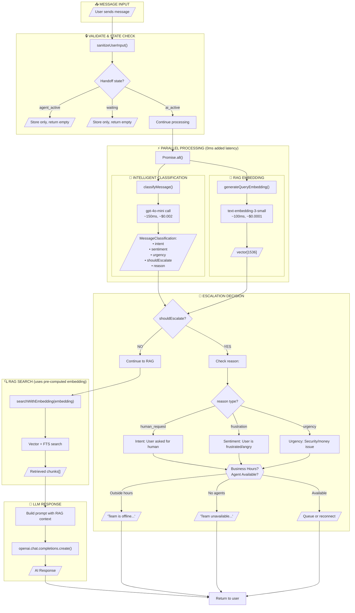

# Intelligent Handoff System

**Created**: 2026-01-23
**Last Updated**: 2026-01-23
**Category**: Chat Engine / Handoff
**Status**: Phase 1 Complete

---

## Progress Tracker

| Phase | Description | Status | Completed |
|-------|-------------|--------|-----------|
| 1 | Fix keyword detection bug | Done | 2026-01-23 |
| 2 | Add intelligent classification | Pending | - |
| 3 | Integrate into chat flow | Pending | - |
| 4 | Multi-turn frustration tracking | Pending | - |

---

## Problem Statement

Users asking to "talk to human" receive confusing fallback responses. But beyond fixing this bug, we want to build a smarter system that:

1. **Detects explicit requests** - "talk to human", "speak to agent"
2. **Detects frustration** - "this is ridiculous", "I've asked 3 times"
3. **Detects urgency** - "my account is hacked", "I'm losing money"
4. **Protects brand** - Escalate before poor customer experience

## Current Bug (Quick Context) - FIXED

- 12 of 15 projects have no `handoff_settings` row
- `getHandoffSettings()` returns `null` → ~~keyword check skipped entirely~~ **Now uses default keywords**
- ~~Users get "I don't have information" instead of proper handoff response~~ **Now get graceful acknowledgment**

**Fix Applied**: Modified `checkHandoffTrigger()` to always check for human intent using default keywords when no settings exist.

---

## Industry Research: How Others Do It

### Tier 1: Simple (Intercom, Zendesk)
- Keyword matching ("frustrated", "angry", "manager")
- Repeated failure count (3 failures → handoff)
- Explicit requests ("talk to human")

### Tier 2: Intermediate (Drift, HubSpot)
- Rule-based sentiment detection
- Topic routing (billing → human)
- VIP customer fast-track

### Tier 3: AI-Native (Ada, Forethought, Cognigy)
- Lightweight ML sentiment classifiers
- Intent classification models
- Multi-turn frustration tracking
- Real-time escalation scoring

---

## Recommended Architecture: Layered Intelligent Handoff

### Layer 1: Fast Keyword Detection (Fix Current Bug)
- Runs BEFORE any API calls
- Zero cost, ~1ms latency
- Catches explicit: "talk to human", "speak to agent"

### Layer 2: Sentiment & Intent Classification (New)
- Lightweight LLM call using gpt-4o-mini
- Runs in parallel with RAG embedding (doesn't add to total latency)
- Cost: ~$0.001-0.003 per message
- Latency: 100-200ms (parallel with RAG)

### Layer 3: Multi-Turn Frustration Tracking (New)
- Track conversation state
- Count: failed answers, repeated questions, negative sentiment
- Escalate after threshold (e.g., 3 negative turns)

### Layer 4: Post-Response Analysis (Enhancement)
- After LLM responds, check if response indicates failure
- Combine with sentiment to decide late-stage handoff

---

## Implementation Plan

### Phase 1: Fix Current Bug (Immediate)

**Goal**: Fix keyword detection so it works regardless of handoff settings.

**Changes to `apps/api/src/services/handoff-trigger.ts`**:

```typescript
// Default keywords for human intent
const DEFAULT_HUMAN_INTENT_KEYWORDS = [
  "human", "agent", "person", "representative", "operator",
  "speak to someone", "talk to someone", "talk to human",
  "real person", "live agent", "customer service",
];

export async function checkHandoffTrigger(...) {
  const settings = await getHandoffSettings(projectId);

  // Always check keywords (use defaults if no settings)
  const keywordsEnabled = settings?.auto_triggers?.keywords_enabled ?? true;
  if (!keywordsEnabled) return { triggered: false, message: "" };

  const keywords = settings?.auto_triggers?.keywords?.length
    ? settings.auto_triggers.keywords
    : DEFAULT_HUMAN_INTENT_KEYWORDS;

  const humanIntent = detectHumanIntent(message, keywords);
  if (!humanIntent.detected) return { triggered: false, message: "" };

  // Intent detected! Return appropriate response based on handoff availability
  if (!settings?.enabled) {
    return {
      triggered: true,
      reason: "keyword",
      message: "I understand you'd like to speak with a human agent. Unfortunately, live support isn't available right now. I'll do my best to help you - what can I assist you with?",
    };
  }

  return executeHandoffFlow({ projectId, visitorId, sessionId, reason: "keyword", settings });
}
```

### Phase 2: Add Intelligent Classification (New Feature)

**New file: `apps/api/src/services/intelligent-handoff.ts`**

```typescript
import { openai } from "../lib/openai";

interface MessageClassification {
  intent: "human_request" | "question" | "complaint" | "feedback" | "greeting";
  sentiment: "positive" | "neutral" | "negative" | "frustrated" | "angry";
  urgency: "low" | "medium" | "high" | "critical";
  shouldEscalate: boolean;
  reason?: string;
}

const CLASSIFICATION_PROMPT = `Classify this customer support message. Return JSON only.

Rules for shouldEscalate = true:
- User explicitly asks for human/agent/representative
- Sentiment is "frustrated" or "angry"
- Urgency is "high" or "critical"
- Message mentions: account compromise, security issue, legal threat, money loss

Message: "{message}"

Return: { "intent": "...", "sentiment": "...", "urgency": "...", "shouldEscalate": true/false, "reason": "..." }`;

export async function classifyMessage(message: string): Promise<MessageClassification> {
  const response = await openai.chat.completions.create({
    model: "gpt-4o-mini",  // Fast & cheap
    messages: [
      { role: "user", content: CLASSIFICATION_PROMPT.replace("{message}", message) }
    ],
    max_tokens: 150,
    temperature: 0,
    response_format: { type: "json_object" },
  });

  return JSON.parse(response.choices[0].message.content || "{}");
}
```

### Phase 3: Integrate Into Chat Flow

**Modified flow in `chat-engine.ts`**:

```typescript
// Current flow:
// 1. Sanitize → 2. Check handoff state → 3. Keyword check → 4. RAG → 5. LLM

// New flow:
// 1. Sanitize
// 2. Check handoff state
// 3. PARALLEL: [Keyword check] + [Intelligent classification] + [RAG embedding]
// 4. Evaluate classification result
// 5. If shouldEscalate → handle appropriately
// 6. Continue to LLM if needed

async function processChat(input: ChatInput) {
  const sanitizedMessage = sanitizeUserInput(input.message);

  // Run in parallel for efficiency
  const [keywordResult, classification, ragEmbedding] = await Promise.all([
    checkKeywordTrigger(sanitizedMessage),           // ~1ms
    classifyMessage(sanitizedMessage),               // ~150ms
    generateQueryEmbedding(sanitizedMessage),        // ~100ms
  ]);

  // Layer 1: Explicit keyword match (fastest)
  if (keywordResult.detected) {
    return handleHandoff(input, "keyword");
  }

  // Layer 2: Intelligent classification
  if (classification.shouldEscalate) {
    logger.info("Intelligent handoff triggered", {
      reason: classification.reason,
      sentiment: classification.sentiment,
      urgency: classification.urgency
    });
    return handleHandoff(input, "intelligent", classification);
  }

  // Continue with RAG search using pre-computed embedding
  const ragResult = await searchWithEmbedding(ragEmbedding, input.projectId);

  // ... rest of flow
}
```

### Phase 4: Multi-Turn Tracking (Future)

Store conversation sentiment history:

```typescript
interface ConversationState {
  sessionId: string;
  negativeCount: number;      // Consecutive negative/frustrated turns
  failedAnswerCount: number;  // Times bot couldn't answer
  sentimentHistory: string[]; // Last 5 sentiments
}

// Escalate if:
// - 3+ consecutive negative sentiments
// - 2+ failed answers in a row
// - Sudden shift from positive to angry
```

---

## Cost & Performance Analysis

| Layer | Latency | Cost per Message | When It Runs |
|-------|---------|------------------|--------------|
| Keyword Detection | ~1ms | $0 | Always (first) |
| Intelligent Classification | ~150ms | ~$0.002 | Parallel with RAG |
| RAG Embedding | ~100ms | ~$0.0001 | Always |
| Full LLM Response | ~500-1000ms | ~$0.01 | If not escalated |

**Total added cost**: ~$0.002 per message for intelligent classification
**Total added latency**: ~0ms (runs in parallel)

---

## Files to Modify/Create

| File | Change |
|------|--------|
| `apps/api/src/services/handoff-trigger.ts` | Fix keyword detection bug |
| NEW: `apps/api/src/services/intelligent-handoff.ts` | Classification service |
| `apps/api/src/services/chat-engine.ts` | Integrate parallel classification |
| `apps/api/src/routes/handoff-settings.ts` | Add intelligent_handoff settings |

---

## Settings Schema (New Fields)

```typescript
interface HandoffSettings {
  enabled: boolean;
  auto_triggers: {
    // Existing
    keywords_enabled: boolean;
    keywords: string[];
    low_confidence_enabled: boolean;
    low_confidence_threshold: number;

    // NEW: Intelligent handoff
    intelligent_handoff_enabled: boolean;
    escalate_on_frustration: boolean;
    escalate_on_urgency: "high" | "critical" | "never";
    frustration_threshold: number;  // 0-1 score
  };
}
```

---

## Verification Steps

### Phase 1 Tests (Bug Fix)
1. "can i talk to any human agent?" → Proper handoff response (not fallback)
2. "i wana talk to human support agent" → Proper handoff response

### Phase 2 Tests (Intelligent Handoff)
1. "This is ridiculous, I've asked 5 times!" → Should escalate (frustration)
2. "My account was hacked and money is missing" → Should escalate (urgency + security)
3. "What are your business hours?" → Should NOT escalate (normal question)
4. "Thanks, that helped!" → Should NOT escalate (positive)

---

## Implementation Recommendation

**Start with Phase 1** (bug fix) - this is quick and solves the immediate problem.

**Then decide on Phase 2** based on:
- Do you want intelligent handoff now, or is it a future feature?
- If now: implement the parallel classification approach
- If later: we can add it as a separate enhancement

---

## Architecture Decision: When to Classify

**Option A: Classify Every Message** (Recommended)
- Run classification in parallel with RAG
- No added latency
- ~$0.002 per message (~$2 per 1000 messages)
- Always have sentiment data for analytics

**Option B: Classify Only After RAG Failure**
- Only run classification if RAG confidence is low
- Saves cost on successful answers
- But misses frustrated users who ask valid questions

**Option C: Classify Based on Signals**
- Only classify if message contains certain trigger words ("frustrated", "angry", punctuation like "!!!")
- Cheapest approach
- May miss subtle frustration

---

## Summary

| Trigger Type | Detection Method | Cost | Latency |
|--------------|------------------|------|---------|
| Explicit request | Keyword matching | $0 | 1ms |
| Frustration | LLM classification | $0.002 | 0ms (parallel) |
| Urgency/Security | LLM classification | $0.002 | 0ms (parallel) |
| Repeated failures | Turn tracking | $0 | 0ms |

This gives you enterprise-grade intelligent handoff that:
- Catches explicit requests instantly (Layer 1 - keywords)
- Detects emotional state and urgency (Layer 2 - classification)
- Protects brand by escalating before bad experiences
- Costs only ~$0.002 extra per message
- Adds zero latency (parallel processing with RAG)

---

---

## NEW: Complete Flow After Removing Keywords

### Current Architecture (24 Cases with Keywords)

```
USER MESSAGE
    │
    ▼
┌─────────────────────────────────────────────────────────────────────────┐
│  1. VALIDATE INPUT                                                       │
│  2. CHECK HANDOFF STATE (agent_active/waiting → store only)              │
│  3. GET PROJECT CONFIG                                                   │
└─────────────────────────────────────────────────────────────────────────┘
    │
    ▼
┌─────────────────────────────────────────────────────────────────────────┐
│  GATE 1: KEYWORD TRIGGER  ◄─── SEQUENTIAL, BLOCKING                     │
│  ─────────────────────────                                              │
│  • Check: "talk to human", "speak to agent", etc.                       │
│  • If matched → Check business hours → Check agents → Queue/Offline     │
│  • Latency: ~10ms (DB lookup for settings)                              │
│  • Cost: $0                                                              │
│  • Problem: Misses frustrated users who don't use magic words           │
└─────────────────────────────────────────────────────────────────────────┘
    │ (if no keyword match)
    ▼
┌─────────────────────────────────────────────────────────────────────────┐
│  RAG SEARCH                                                              │
│  ───────────                                                             │
│  • Generate embedding (~100ms)                                           │
│  • Vector + Full-text search                                             │
│  • RRF fusion                                                            │
└─────────────────────────────────────────────────────────────────────────┘
    │
    ▼
┌─────────────────────────────────────────────────────────────────────────┐
│  GATE 2: LOW CONFIDENCE CHECK  ◄─── SEQUENTIAL, AFTER RAG               │
│  ─────────────────────────────                                          │
│  • If maxScore < 0.3 → Check hours → Check agents → Queue               │
│  • Problem: User already waited for RAG, now waits for handoff check    │
└─────────────────────────────────────────────────────────────────────────┘
    │ (if confidence OK)
    ▼
┌─────────────────────────────────────────────────────────────────────────┐
│  LLM CALL (~500-1000ms)                                                  │
│  LEAD CAPTURE                                                            │
│  RETURN RESPONSE                                                         │
└─────────────────────────────────────────────────────────────────────────┘
```

### NEW Architecture (Intelligent Handoff - No Keywords)

```
USER MESSAGE
    │
    ▼
┌─────────────────────────────────────────────────────────────────────────┐
│  1. VALIDATE INPUT                                                       │
│  2. CHECK HANDOFF STATE (agent_active/waiting → store only)              │
│  3. GET PROJECT CONFIG                                                   │
└─────────────────────────────────────────────────────────────────────────┘
    │
    ▼
┌─────────────────────────────────────────────────────────────────────────┐
│                        PARALLEL PROCESSING                               │
│  ══════════════════════════════════════════════════════════════════════ │
│                                                                          │
│   ┌─────────────────────────┐     ┌─────────────────────────┐           │
│   │  INTELLIGENT            │     │  RAG EMBEDDING          │           │
│   │  CLASSIFICATION         │     │                         │           │
│   │  ─────────────────      │     │  ─────────────────      │           │
│   │  • gpt-4o-mini          │     │  • text-embedding-3     │           │
│   │  • Detect intent        │     │  • Generate vector      │           │
│   │  • Detect sentiment     │     │  • ~100ms               │           │
│   │  • Detect urgency       │     │                         │           │
│   │  • ~150ms               │     │                         │           │
│   │  • Cost: ~$0.002        │     │  • Cost: ~$0.0001       │           │
│   └────────────┬────────────┘     └────────────┬────────────┘           │
│                │                               │                         │
│                └───────────┬───────────────────┘                         │
│                            │                                             │
│                     Both complete                                        │
│                      in ~150ms                                           │
│                            │                                             │
└────────────────────────────┼─────────────────────────────────────────────┘
                             │
                             ▼
┌─────────────────────────────────────────────────────────────────────────┐
│  EVALUATE CLASSIFICATION RESULT                                          │
│  ═══════════════════════════════                                         │
│                                                                          │
│   ┌─────────────────────────────────────────────────────────────────┐   │
│   │  shouldEscalate = true if ANY of:                                │   │
│   │  ─────────────────────────────────                               │   │
│   │  • intent = "human_request"     (explicit request)               │   │
│   │  • sentiment = "frustrated"     (user is upset)                  │   │
│   │  • sentiment = "angry"          (user is very upset)             │   │
│   │  • urgency = "high"             (account issues)                 │   │
│   │  • urgency = "critical"         (security/money)                 │   │
│   └─────────────────────────────────────────────────────────────────┘   │
│                                                                          │
│                          │                                               │
│              ┌───────────┴───────────┐                                   │
│              │                       │                                   │
│       shouldEscalate            shouldEscalate                           │
│          = true                   = false                                │
│              │                       │                                   │
│              ▼                       ▼                                   │
│   ┌─────────────────────┐   ┌─────────────────────┐                     │
│   │  HANDOFF FLOW       │   │  CONTINUE TO RAG    │                     │
│   │  ─────────────────  │   │  (use pre-computed  │                     │
│   │  • Check hours      │   │   embedding)        │                     │
│   │  • Check agents     │   │                     │                     │
│   │  • Queue or message │   │                     │                     │
│   └─────────────────────┘   └──────────┬──────────┘                     │
│              │                         │                                 │
│              │                         ▼                                 │
│              │              ┌─────────────────────┐                     │
│              │              │  RAG SEARCH         │                     │
│              │              │  (using embedding)  │                     │
│              │              │  • Vector search    │                     │
│              │              │  • FTS search       │                     │
│              │              │  • RRF fusion       │                     │
│              │              └──────────┬──────────┘                     │
│              │                         │                                 │
│              │                         ▼                                 │
│              │              ┌─────────────────────┐                     │
│              │              │  LLM CALL           │                     │
│              │              │  (with RAG context) │                     │
│              │              └──────────┬──────────┘                     │
│              │                         │                                 │
│              └────────────┬────────────┘                                 │
│                           │                                              │
│                           ▼                                              │
│                    RETURN RESPONSE                                       │
│                                                                          │
└─────────────────────────────────────────────────────────────────────────┘
```

### Key Differences: Keywords vs Intelligent Classification

| Aspect | Keywords (Current) | Intelligent (New) |
|--------|-------------------|-------------------|
| **Detection** | Exact string match | LLM understanding |
| **"talk to human"** | ✅ Detected | ✅ Detected |
| **"i wana talk to human support agnet"** | ❌ Typos break it | ✅ LLM understands |
| **"This is ridiculous!!!"** | ❌ No keyword match | ✅ Detects frustration |
| **"My account was hacked"** | ❌ No keyword match | ✅ Detects urgency |
| **"I've asked 5 times already"** | ❌ No keyword match | ✅ Detects frustration |
| **Latency** | ~1ms | ~150ms (parallel) |
| **Total added latency** | N/A | 0ms (runs with RAG) |
| **Cost** | $0 | ~$0.002/message |
| **Maintenance** | Must update keyword list | Self-learning |

### What Gets Removed

```diff
- GATE 1: KEYWORD TRIGGER CHECK
-   • checkHandoffTrigger() before RAG
-   • Sequential blocking call
-   • Keyword list maintenance
-   • DEFAULT_HUMAN_INTENT_KEYWORDS array

- GATE 2: LOW CONFIDENCE CHECK (optional - can be merged)
-   • checkLowConfidenceHandoff() after RAG
-   • Separate check for RAG failure
-   • Can be handled by classification instead
```

### What Gets Added

```diff
+ INTELLIGENT CLASSIFICATION SERVICE
+   • classifyMessage() - parallel with RAG embedding
+   • Detects: intent, sentiment, urgency
+   • Returns: shouldEscalate boolean with reason
+   • Cost: ~$0.002/message (~$2 per 1000 messages)

+ PARALLEL PROCESSING
+   • Promise.all([classification, embedding])
+   • Zero added latency vs current flow
+   • Embedding reused for RAG search

+ UNIFIED HANDOFF DECISION
+   • Single point for all escalation decisions
+   • Based on classification result
+   • Includes: human request, frustration, urgency
```

---

## MERMAID: New Intelligent Handoff Flow



---

## Simplified Decision Tree (New Flow)

```
MESSAGE IN
    │
    ├── Empty? ────────────────────────────────────► Error
    │
    ├── Already with human? ───────────────────────► Store only
    │
    ├── PARALLEL: [Classify] + [Embed] ◄───────────── ~150ms total
    │       │
    │       ▼
    │   Classification Result:
    │       │
    │       ├── shouldEscalate = true?
    │       │       │
    │       │       ├── reason: "human_request" ───► Handoff (user asked)
    │       │       ├── reason: "frustration" ─────► Handoff (upset user)
    │       │       └── reason: "urgency" ─────────► Handoff (critical issue)
    │       │
    │       └── shouldEscalate = false ────────────► Continue to RAG
    │
    ├── RAG Search (using pre-computed embedding)
    │
    ├── LLM Call
    │
    └── Return Response
```

---

## What Cases Are Now Covered

| Case | Keyword Detection | Intelligent Classification |
|------|-------------------|---------------------------|
| "talk to human" | ✅ | ✅ (intent: human_request) |
| "speak with agent" | ✅ | ✅ (intent: human_request) |
| "i need help from a real person" | ❌ (no exact match) | ✅ (intent: human_request) |
| "This is SO frustrating!!!" | ❌ | ✅ (sentiment: frustrated) |
| "I've asked this 3 times already" | ❌ | ✅ (sentiment: frustrated) |
| "Your bot is useless" | ❌ | ✅ (sentiment: angry) |
| "My account was hacked" | ❌ | ✅ (urgency: critical) |
| "Someone stole my money" | ❌ | ✅ (urgency: critical) |
| "I'm going to sue you" | ❌ | ✅ (urgency: high) |
| "What are your hours?" | N/A (no trigger) | ✅ (shouldEscalate: false) |
| "Thanks for your help!" | N/A (no trigger) | ✅ (sentiment: positive) |

---

## Implementation: Remove Keywords, Add Classification

### Step 1: Create `intelligent-handoff.ts`

```typescript
// apps/api/src/services/intelligent-handoff.ts

import { openai } from "../lib/openai";
import { logger } from "../lib/logger";

export interface MessageClassification {
  intent: "human_request" | "question" | "complaint" | "feedback" | "greeting" | "other";
  sentiment: "positive" | "neutral" | "negative" | "frustrated" | "angry";
  urgency: "low" | "medium" | "high" | "critical";
  shouldEscalate: boolean;
  reason?: string;
}

const CLASSIFICATION_PROMPT = `You are a customer support message classifier. Analyze the message and return JSON.

ESCALATION RULES (shouldEscalate = true):
1. User explicitly asks for human/agent/representative/support person
2. User sentiment is "frustrated" or "angry" (showing clear displeasure)
3. Urgency is "high" or "critical" (security breach, money loss, legal threat)
4. Message indicates repeated failed attempts ("I've asked before", "third time asking")

URGENCY LEVELS:
- low: General questions, no time pressure
- medium: Wants timely response but not urgent
- high: Account issues, billing problems, service disruption
- critical: Security breach, unauthorized access, money stolen, legal threats

Message: """
{message}
"""

Return ONLY valid JSON:
{"intent":"...","sentiment":"...","urgency":"...","shouldEscalate":true/false,"reason":"brief reason if escalating"}`;

export async function classifyMessage(message: string): Promise<MessageClassification> {
  const startTime = Date.now();

  try {
    const response = await openai.chat.completions.create({
      model: "gpt-4o-mini",
      messages: [
        { role: "user", content: CLASSIFICATION_PROMPT.replace("{message}", message) }
      ],
      max_tokens: 150,
      temperature: 0,
      response_format: { type: "json_object" },
    });

    const result = JSON.parse(response.choices[0].message.content || "{}");

    logger.info("Message classified", {
      latencyMs: Date.now() - startTime,
      intent: result.intent,
      sentiment: result.sentiment,
      urgency: result.urgency,
      shouldEscalate: result.shouldEscalate,
      step: "intelligent_classification",
    });

    return result;
  } catch (error) {
    logger.error("Classification failed, defaulting to no-escalate", error, {
      step: "intelligent_classification_error",
    });

    // Safe default: don't escalate on classification failure
    return {
      intent: "other",
      sentiment: "neutral",
      urgency: "low",
      shouldEscalate: false,
    };
  }
}
```

### Step 2: Modify `chat-engine.ts`

```typescript
// In processChat():

// OLD (sequential):
// const handoffResult = await checkHandoffTrigger(projectId, message, visitorId, sessionId);
// if (handoffResult.triggered) return handleHandoff(...);
// const ragResult = await retrieve(projectId, message);

// NEW (parallel):
import { classifyMessage } from "./intelligent-handoff";

const sanitizedMessage = sanitizeUserInput(input.message);

// Run classification and embedding in parallel
const [classification, queryEmbedding] = await Promise.all([
  classifyMessage(sanitizedMessage),
  generateQueryEmbedding(sanitizedMessage),
]);

// Check if we should escalate to human
if (classification.shouldEscalate) {
  logger.info("Intelligent handoff triggered", {
    reason: classification.reason,
    sentiment: classification.sentiment,
    urgency: classification.urgency,
    intent: classification.intent,
    step: "intelligent_handoff_trigger",
  });

  // Execute handoff flow (same as before, just different trigger)
  return executeIntelligentHandoff({
    projectId,
    visitorId,
    sessionId,
    classification,
  });
}

// Continue with RAG using pre-computed embedding
const ragResult = await searchWithEmbedding(queryEmbedding, projectId);
// ... rest of flow
```

### Step 3: Remove Keyword Detection

```typescript
// In handoff-trigger.ts:

// DELETE: DEFAULT_HUMAN_INTENT_KEYWORDS
// DELETE: checkKeywordTrigger()
// KEEP: executeHandoffFlow() - reused by intelligent handoff
// KEEP: checkAgentAvailability()
// KEEP: isWithinBusinessHours()
// KEEP: createHandoffConversation()
```

---

## Cost Analysis: Keywords vs Intelligent

| Metric | Keywords Only | Intelligent Only |
|--------|--------------|------------------|
| Cost per message | $0 | ~$0.002 |
| Cost per 1,000 messages | $0 | ~$2 |
| Cost per 10,000 messages | $0 | ~$20 |
| Cost per 100,000 messages | $0 | ~$200 |
| **Detection accuracy** | Low (exact match) | High (semantic) |
| **Frustrated user detection** | ❌ None | ✅ Yes |
| **Urgency detection** | ❌ None | ✅ Yes |
| **Typo tolerance** | ❌ None | ✅ Yes |
| **Brand protection** | Low | High |

**ROI Consideration**: One escalated frustrated user costs more in reputation damage than $200 worth of classification calls.

---

## Change Log

| Date | Change | By |
|------|--------|-----|
| 2026-01-23 | Initial document created | Claude |
| 2026-01-23 | Phase 1 implemented - keyword detection now works for all projects | Claude |
| 2026-01-23 | Added complete flow diagrams for keyword removal and intelligent classification | Claude |
