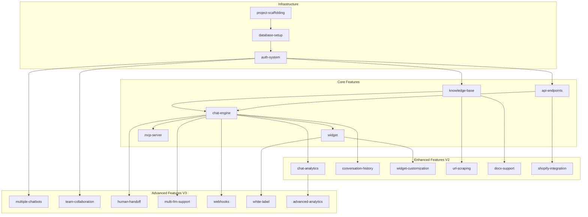

# Feature Index

## Product Overview

**Product**: AI Chatbot for Small Business & Vibe Coders

**Core Value Proposition**: The AI chatbot that installs in one line and works in 15 minutes.

**Tech Stack**:
- Frontend: Next.js 14+ (App Router), shadcn/ui, Tailwind CSS
- Backend: Node.js (Express/Fastify)
- Database: Supabase PostgreSQL with pgvector
- Auth: Supabase Auth (magic links)
- LLM: OpenAI GPT-4o-mini
- Embeddings: OpenAI text-embedding-3-small
- Widget: Preact/Vanilla JS
- Monorepo: Turborepo

---

## Dependency Graph

---

## Implementation Order

### Phase 1: Infrastructure (Sequential - Must be done in order)
1. `project-scaffolding` - Monorepo setup with all apps/packages
2. `database-setup` - Supabase schema, migrations, RLS, pgvector
3. `auth-system` - Magic link authentication with project auto-creation

### Phase 2: Core Features (V1 MVP - Can parallelize after dependencies met)
4. `knowledge-base` - Upload and manage knowledge sources (depends on: database-setup, auth-system)
5. `api-endpoints` - Configure external API tools (depends on: database-setup, auth-system)
6. `chat-engine` - RAG-based chat with tool calling (depends on: knowledge-base, api-endpoints)
7. `widget` - Embeddable chat widget (depends on: chat-engine)
8. `mcp-server` - MCP server for AI platforms (depends on: chat-engine)

### Phase 3: Enhanced Features (V2 - Post-MVP)
9. `chat-analytics` - Message count, popular questions, response quality
10. `conversation-history` - View past chats in dashboard
11. `widget-customization` - Colors, position, branding
12. `url-scraping` - Add knowledge from webpage URL
13. `docx-support` - Support for .doc/.docx files
14. `shopify-integration` - Native MCP for Shopify data

### Phase 4: Advanced Features (V3 - Scale & Enterprise)
15. `multiple-chatbots` - Multiple projects per account
16. `team-collaboration` - Invite team members
17. `human-handoff` - Escalate to live support
18. `multi-llm-support` - Claude, Llama, etc.
19. `webhooks` - Notify on events
20. `white-label` - Remove branding
21. `advanced-analytics` - Sentiment, topics, trends

---

## Feature Status

| Feature | Category | Complexity | Status | Dependencies |
|---------|----------|------------|--------|--------------|
| project-scaffolding | infrastructure | XL | completed | none |
| database-setup | infrastructure | L | completed | project-scaffolding |
| auth-system | infrastructure | M | completed | database-setup |
| knowledge-base | core | L | completed | database-setup, auth-system |
| api-endpoints | core | M | completed | database-setup, auth-system |
| chat-engine | core | L | completed | knowledge-base, api-endpoints |
| widget | core | L | completed | chat-engine |
| mcp-server | core | M | completed | chat-engine |
| chat-analytics | enhanced | M | pending | chat-engine |
| conversation-history | enhanced | S | pending | chat-engine |
| widget-customization | enhanced | M | pending | widget |
| url-scraping | enhanced | M | pending | knowledge-base |
| docx-support | enhanced | S | pending | knowledge-base |
| shopify-integration | enhanced | L | pending | api-endpoints |
| multiple-chatbots | advanced | M | pending | auth-system |
| team-collaboration | advanced | L | pending | auth-system |
| human-handoff | advanced | L | pending | chat-engine |
| multi-llm-support | advanced | M | pending | chat-engine |
| webhooks | advanced | M | pending | chat-engine |
| white-label | advanced | M | pending | widget |
| advanced-analytics | advanced | L | pending | chat-analytics |

---

## Complexity Legend

| Size | Description | Estimated Scope |
|------|-------------|-----------------|
| S | Small | Single component/function, minimal integration |
| M | Medium | Multiple components, moderate integration |
| L | Large | Multiple files, significant integration |
| XL | Extra Large | Multiple systems, extensive setup |

---

## Feature Specifications

### Infrastructure
- [project-scaffolding](./infrastructure/project-scaffolding/spec.md)
- [database-setup](./infrastructure/database-setup/spec.md)
- [auth-system](./infrastructure/auth-system/spec.md)

### Core Features (V1)
- [knowledge-base](./core/knowledge-base/spec.md)
- [api-endpoints](./core/api-endpoints/spec.md)
- [chat-engine](./core/chat-engine/spec.md)
- [widget](./core/widget/spec.md)
- [mcp-server](./core/mcp-server/spec.md)

### Enhanced Features (V2)
- [chat-analytics](./enhanced/chat-analytics/spec.md)
- [conversation-history](./enhanced/conversation-history/spec.md)
- [widget-customization](./enhanced/widget-customization/spec.md)
- [url-scraping](./enhanced/url-scraping/spec.md)
- [docx-support](./enhanced/docx-support/spec.md)
- [shopify-integration](./enhanced/shopify-integration/spec.md)

### Advanced Features (V3)
- [multiple-chatbots](./advanced/multiple-chatbots/spec.md)
- [team-collaboration](./advanced/team-collaboration/spec.md)
- [human-handoff](./advanced/human-handoff/spec.md)
- [multi-llm-support](./advanced/multi-llm-support/spec.md)
- [webhooks](./advanced/webhooks/spec.md)
- [white-label](./advanced/white-label/spec.md)
- [advanced-analytics](./advanced/advanced-analytics/spec.md)

---

## Quick Start Guide

1. **Review Infrastructure Specs First** - These establish the foundation
2. **Implement in Dependency Order** - Follow the graph above
3. **Each Spec is Self-Contained** - Engineer/AI can implement without asking questions
4. **Track Status** - Update the table above as features are completed

---

## Architecture Documentation

- [System Overview](../architecture/system-overview.md) - High-level architecture and data flow

---

## Estimated Effort Summary

| Phase | Features | Total Effort |
|-------|----------|--------------|
| Infrastructure | 3 features | 7-11 days |
| Core (V1) | 5 features | 18-23 days |
| Enhanced (V2) | 6 features | 16-23 days |
| Advanced (V3) | 7 features | 24-35 days |
| **Total** | **21 features** | **65-92 days** |

*Note: Parallelization can reduce calendar time significantly.*

---

## Success Metrics

### V1 Launch
- Time to first chatbot: <20 minutes
- Setup completion rate: >70%
- Chat response accuracy: >80%
- Widget load time: <2 seconds
- Chat response time: <5 seconds

### Post-Launch
- Monthly active projects: Track
- Messages per project: Track
- MCP installations: Track
- User retention: >90% monthly

---

## Next Steps for Engineering

1. **Review infrastructure specs first** - Start with project-scaffolding
2. **Set up Supabase project** - Configure database and auth
3. **Implement features in dependency order** - Use the graph above
4. **Each spec is self-contained** - Assign to engineers or AI assistants
5. **Update status table** - Mark features as in-progress/completed

---

**Document Version**: 1.0
**Last Updated**: December 2024
**Author**: Morgan (Principal PM)
**Spec Count**: 21 features documented
